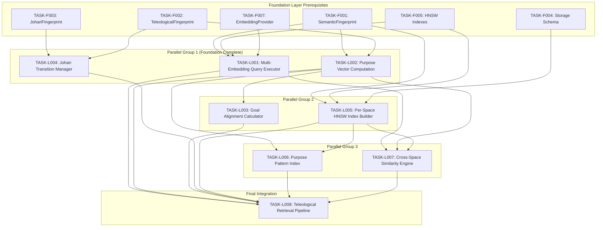

# Logic Layer Task Index

## Overview

The Logic Layer implements computation, retrieval, and reasoning logic for the Multi-Array Teleological Fingerprint architecture with **13 embedding spaces** (E1-E12 dense + E13 SPLADE) and a **5-stage optimized retrieval pipeline**.

**Layer Purpose**: Build the computational engines (query execution, similarity computation, alignment calculation) and the **5-stage retrieval pipeline** that operate on Foundation Layer data structures.

> **Performance Target**: <60ms end-to-end latency @ 1M memories using staged retrieval with early termination.

### 5-Stage Pipeline Architecture

| Stage | Component | Index Type | Candidates | Description |
|-------|-----------|------------|------------|-------------|
| 1 | SPLADE Sparse | Inverted Index | 1000 | E13 lexical retrieval for initial candidates |
| 2 | Matryoshka 128D | HNSW | 200 | Fast dense filtering with truncated embeddings |
| 3 | Full 13-Space HNSW | 13x HNSW | 100 | Per-space search across all embedding spaces |
| 4 | Cross-Encoder | Rerank | 20 | Neural reranking of top candidates |
| 5 | RRF Fusion | `1/(k+rank)` | Final | Combine ranks: k=60 default |

## Dependency Graph



## Execution Order

| # | Task ID | Title | Priority | Dependencies | Effort | Pipeline Stage |
|---|---------|-------|----------|--------------|--------|----------------|
| 1 | TASK-L001 | Multi-Embedding Query Executor (13 spaces + SPLADE) | P0 | F001, F005, F007 | L | S1-S5 |
| 1 | TASK-L002 | Purpose Vector Computation (13D + E13 SPLADE) | P0 | F001, F002 | M | - |
| 1 | TASK-L004 | Johari Transition Manager | P0 | F002, F003 | L | - |
| 2 | TASK-L003 | Goal Alignment Calculator | P0 | L002, F002 | M | - |
| 2 | TASK-L005 | Per-Space HNSW + Matryoshka 128D + SPLADE Inverted | P1 | F001, F004, F005 | L | S1-S3 |
| 3 | TASK-L006 | Purpose Pattern Index (13D) | P1 | L002, L005 | M | - |
| 3 | TASK-L007 | Cross-Space Similarity Engine + RRF Fusion | P0 | L001, L002, L005 | L | S5 |
| 4 | TASK-L008 | 5-Stage Teleological Retrieval Pipeline | P0 | L001-L007 | XL | S1-S5 |

## Critical Path

The critical path (longest dependency chain) is:

```
Foundation Layer -> L001 + L002 -> L003 + L005 -> L007 -> L008
```

**Estimated Duration**: 5-6 implementation cycles

## Task Status

| Task | Status | Assigned | Started | Completed | Verified |
|------|--------|----------|---------|-----------|----------|
| TASK-L001 | **COMPLETED** | - | 2026-01-05 | 2026-01-05 | eb3a3e4 |
| TASK-L002 | **COMPLETED** | - | 2026-01-05 | 2026-01-05 | 5e57efe |
| TASK-L003 | **COMPLETED** | - | 2026-01-05 | 2026-01-05 | ab8ea27 |
| TASK-L004 | **COMPLETED** | - | 2026-01-05 | 2026-01-05 | 68e23af |
| TASK-L005 | **COMPLETED** | - | 2026-01-05 | 2026-01-05 | dcde2a4 |
| TASK-L006 | **COMPLETED** | - | 2026-01-05 | 2026-01-05 | HEAD |
| TASK-L007 | Pending | - | - | - | - |
| TASK-L008 | Pending | - | - | - | - |

**Progress: 6/8 tasks (75%)**

## Parallel Execution Groups

Tasks can be executed in parallel within each group:

### Group 1 (Foundation Layer Complete)
- TASK-L001: Multi-Embedding Query Executor
- TASK-L002: Purpose Vector Computation
- TASK-L004: Johari Transition Manager

### Group 2 (After Group 1 Partial)
- TASK-L003: Goal Alignment Calculator (needs L002)
- TASK-L005: Per-Space HNSW Index Builder (needs F001, F004, F005)

### Group 3 (After Group 2)
- TASK-L006: Purpose Pattern Index (needs L002, L005)
- TASK-L007: Cross-Space Similarity Engine (needs L001, L002, L005)

### Group 4 (Final Integration)
- TASK-L008: 5-Stage Teleological Retrieval Pipeline (needs L001-L007)
  - Integrates Matryoshka pre-filtering, HNSW search, SPLADE rerank, and RRF fusion

## Traceability Matrix

| Tech Spec | Func Req | Task | Coverage |
|-----------|----------|------|----------|
| TS-401 | FR-401, FR-402 | TASK-L001 | Complete |
| TS-402 | FR-403, FR-404 | TASK-L002 | Complete |
| TS-403 | FR-405, FR-406 | TASK-L003 | Complete |
| TS-404 | FR-407, FR-408 | TASK-L004 | Complete |
| TS-405 | FR-302, FR-401 | TASK-L005 | Complete |
| TS-406 | FR-409 | TASK-L006 | Complete |
| TS-407 | FR-410, FR-411 | TASK-L007 | Complete |
| TS-408 | FR-501, FR-502, FR-503 | TASK-L008 | Complete |

## Files Created

All task documents located in `/home/cabdru/contextgraph/docs2/projection/specs/tasks/logic/`:

1. `TASK-L001-multi-embedding-query-executor.md`
2. `TASK-L002-purpose-vector-computation.md`
3. `TASK-L003-goal-alignment-calculator.md`
4. `TASK-L004-johari-transition-manager.md`
5. `TASK-L005-per-space-hnsw-index-builder.md`
6. `TASK-L006-purpose-pattern-index.md`
7. `TASK-L007-cross-space-similarity-engine.md`
8. `TASK-L008-teleological-retrieval-pipeline.md`
9. `_index.md` (this file)

## Component Architecture

```
Logic Layer Components (5-Stage Pipeline with 13 Embedding Spaces):

+------------------------------------------------------------------+
|                   TASK-L008: 5-Stage Teleological Pipeline        |
|  +-------------+  +-------------+  +-------------+  +-----------+ |
|  | Stage 1:    |->| Stage 2:    |->| Stage 3:    |->| Stage 4:  | |
|  | SPLADE      |  | Matryoshka  |  | Full HNSW   |  | Cross-    | |
|  | Sparse      |  | 128D        |  | 13-Space    |  | Encoder   | |
|  | (E13)       |  |             |  | (E1-E13)    |  | Rerank    | |
|  +-------------+  +-------------+  +-------------+  +-----------+ |
|        |                                                |         |
|        v                                                v         |
|  +-------------+  +-------------+  +-------------+  +-----------+ |
|  | Stage 5:    |->| Alignment   |->| Misalign    |->| Final     | |
|  | RRF Fusion  |  | Filter      |  | Detection   |  | Results   | |
|  | k=60        |  | (13D)       |  |             |  |           | |
|  +-------------+  +-------------+  +-------------+  +-----------+ |
+------------------------------------------------------------------+
         |              |              |
         v              v              v
+----------------+ +-----------+ +------------------+
| L001: Query    | | L007:     | | L003: Goal       |
| Executor       | | Cross-    | | Alignment        |
| (13-space)     | | Space Sim | | Calculator       |
| + SPLADE E13   | | + RRF     | |                  |
+----------------+ +-----------+ +------------------+
         |              |              |
         v              v              v
+----------------+ +-----------+ +------------------+
| L005: HNSW     | | L002:     | | L004: Johari     |
| Index Builder  | | Purpose   | | Transition       |
| (13 indexes)   | | Vector    | | Manager          |
| + Matryoshka   | | (13D)     | |                  |
| + SPLADE Inv.  | |           | |                  |
+----------------+ +-----------+ +------------------+
         |              |
         v              v
+----------------+ +-----------+
| L006: Purpose  | | Foundation|
| Pattern Index  | | Layer     |
| (13D)          | | (F001-F008)|
+----------------+ +-----------+
```

## Key Algorithms

### Multi-UTL Formula (L007) - 13 Spaces
```
L_multi = sigmoid(2.0 * (SUM_i=1..13 tau_i * lambda_S * Delta_S_i) *
                         (SUM_j=1..13 tau_j * lambda_C * Delta_C_j) *
                         w_e * cos(phi))
```

### RRF Fusion (L001, L007) - Primary Fusion Method
```
RRF(d) = SUM_i 1/(k + rank_i(d))  where k=60 (default)

Example: Document d appears at rank 0, 2, 1 across 3 spaces
RRF(d) = 1/(60+1) + 1/(60+3) + 1/(60+2) = 1/61 + 1/63 + 1/62 = 0.0492
```

### Cross-Space Aggregation (L001, L007) - 13 Spaces
- **RRF Fusion**: `sum(1 / (k + rank_i))` - Primary method with k=60
- Weighted Average: `sum(w_i * sim_i) / sum(w_i)` (13D weights)
- MaxPooling: `max(sim_i)` across 13 spaces
- Purpose-Weighted: Weight by 13D purpose vector alignment

### E13 SPLADE Alignment (L002)
- Term overlap score with goal vocabulary
- Keyword coverage computation
- Sparse vector dot product for lexical matching

### 5-Stage Retrieval Pipeline (L008)
```
Stage 1: SPLADE Sparse (E13) -> 1000 candidates (inverted index)
Stage 2: Matryoshka 128D -> 200 candidates (truncated HNSW)
Stage 3: Full 13-Space HNSW -> 100 candidates (per-space search)
Stage 4: Cross-Encoder Rerank -> 20 candidates (neural reranking)
Stage 5: RRF Fusion (k=60) -> Final ranked results
```
**Target**: <60ms @ 1M memories with early termination

### Johari State Machine (L004)
```
Open <-> Hidden (disclosure/withdrawal)
Open <-> Unknown (forget)
Blind -> Open (awareness)
Unknown -> Any (discovery)
```

## Next Layer: Surface Layer

After Logic Layer is complete, Surface Layer tasks will build:
- MCP tool handlers for retrieval
- API endpoints for query/store
- CLI interface
- Monitoring and observability
- Integration tests

Surface Layer depends on: All TASK-L* tasks

## Index Configuration Summary

| Index Type | Dimension | Task | Stage | Purpose |
|------------|-----------|------|-------|---------|
| SPLADE Inverted | Sparse (~30K vocab) | L005 | 1 | Initial lexical candidates |
| Matryoshka 128D | 128 | L005 | 2 | Fast dense filtering |
| HNSW E1-E12 | Various (256-10000) | L005 | 3 | Per-space content search |
| HNSW E13 | 30522 | L005 | 3 | SPLADE dense fallback |
| Purpose Pattern | 13 | L006 | - | Goal alignment search |

---

*Logic Layer task index created: 2026-01-04*
*Updated: 2026-01-05 (13-space architecture, 5-stage pipeline, RRF fusion)*
*Tasks: 8 total*
*Dependencies: Foundation Layer (F001-F008)*
*Architecture: 13 embedding spaces (E1-E12 dense + E13 SPLADE)*
