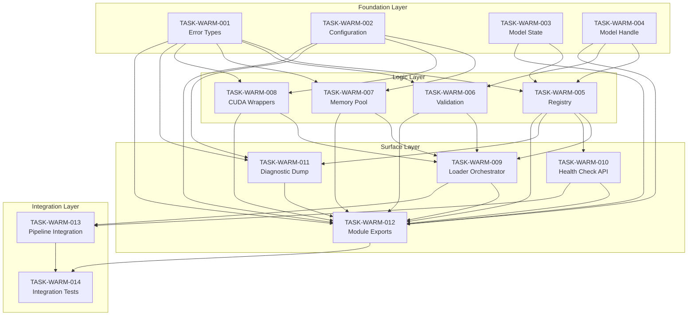

# Warm Model Loading System - Task Index

```yaml
task_index_id: TASK-INDEX-WARM-LOADING
version: 1.0
status: approved
functional_spec_ref: SPEC-WARM-LOADING
technical_spec_ref: TECH-WARM-LOADING
created: 2026-01-03
author: Task Index Generator Agent #3
total_tasks: 14
estimated_total_lines: 2100
```

---

## Executive Summary

This Task Index decomposes the Warm Model Loading System into 14 discrete tasks organized across 4 layers:
- **Foundation Layer (4 tasks)**: Core types with zero internal dependencies
- **Logic Layer (4 tasks)**: Business logic depending on Foundation
- **Surface Layer (4 tasks)**: Orchestration and APIs depending on Logic
- **Integration Layer (2 tasks)**: System integration and testing

All 18 requirements (REQ-WARM-001 through REQ-WARM-018) are fully covered.

---

## Dependency Graph



---

## Task Definitions

### Foundation Layer

These tasks have **NO dependencies** on other warm-loading code. They can be executed in parallel.

---

```yaml
task_id: TASK-WARM-001
title: Implement WarmError types and exit codes
layer: foundation
file: crates/context-graph-embeddings/src/warm/error.rs
dependencies: []
requirements:
  - REQ-WARM-008  # Startup failure exit codes
  - REQ-WARM-009  # VRAM insufficient error
  - REQ-WARM-010  # CUDA init failure
  - REQ-WARM-014  # Comprehensive error logging
estimated_lines: 200
acceptance_criteria:
  - WarmError enum with 15+ variants defined
  - Each error variant maps to exit code 101-110 as specified
  - exit_code() method returns correct i32 for each variant
  - is_fatal() method correctly identifies startup-blocking errors
  - thiserror derive for Display implementation
  - All error fields documented with rustdoc
  - Unit tests for exit code mapping
test_cases:
  - TC-WARM-009
  - TC-WARM-010
  - TC-WARM-011
agent_type: coder
priority: critical
```

---

```yaml
task_id: TASK-WARM-002
title: Implement WarmConfig configuration struct
layer: foundation
file: crates/context-graph-embeddings/src/warm/config.rs
dependencies: []
requirements:
  - REQ-WARM-012  # VRAM budget enforcement
  - REQ-WARM-013  # VRAM usage reporting
estimated_lines: 150
acceptance_criteria:
  - WarmConfig struct with all 8 fields from spec
  - QuantizationMode enum (Fp32, Fp16, Fp8)
  - Default implementation with correct values (24GB budget, 8GB headroom)
  - from_env() loads from WARM_* environment variables
  - validate() checks config consistency
  - total_vram_required() helper method
  - Environment variable table in rustdoc
  - Unit tests for env var parsing
test_cases:
  - TC-WARM-001
  - TC-WARM-002
agent_type: coder
priority: critical
```

---

```yaml
task_id: TASK-WARM-003
title: Implement WarmModelState enum
layer: foundation
file: crates/context-graph-embeddings/src/warm/state.rs
dependencies: []
requirements:
  - REQ-WARM-006  # Health check status reporting
estimated_lines: 80
acceptance_criteria:
  - WarmModelState enum with 5 variants (Pending, Loading, Validating, Warm, Failed)
  - Loading variant has progress_percent and bytes_loaded fields
  - Failed variant has error_code and error_message fields
  - is_warm(), is_failed(), is_loading() helper methods
  - State transition diagram in rustdoc
  - Derive Debug, Clone, Copy, PartialEq, Eq, Hash
  - Unit tests for state transitions
test_cases:
  - TC-WARM-008
agent_type: coder
priority: critical
```

---

```yaml
task_id: TASK-WARM-004
title: Implement ModelHandle struct
layer: foundation
file: crates/context-graph-embeddings/src/warm/handle.rs
dependencies: []
requirements:
  - REQ-WARM-004  # VRAM residency tracking
  - REQ-WARM-006  # Health check VRAM address reporting
estimated_lines: 100
acceptance_criteria:
  - ModelHandle struct with vram_base_ptr, allocation_bytes, device_ordinal, allocated_at, weight_checksum
  - new() constructor with all parameters
  - vram_address() returns u64 for health reporting
  - allocation_bytes() getter
  - device_ordinal() getter
  - weight_checksum() getter for integrity verification
  - uptime() returns Duration since allocation
  - Memory layout diagram in rustdoc
  - Safety documentation for GPU pointer handling
test_cases:
  - TC-WARM-008
agent_type: coder
priority: critical
```

---

### Logic Layer

These tasks depend on Foundation layer. Tasks within this layer can run in parallel once Foundation is complete.

---

```yaml
task_id: TASK-WARM-005
title: Implement WarmModelRegistry
layer: logic
file: crates/context-graph-embeddings/src/warm/registry.rs
dependencies:
  - TASK-WARM-001  # WarmError
  - TASK-WARM-003  # WarmModelState
  - TASK-WARM-004  # ModelHandle
requirements:
  - REQ-WARM-001  # Track all 12 models
  - REQ-WARM-002  # Track FuseMoE layer
  - REQ-WARM-004  # Maintain VRAM residency
estimated_lines: 300
acceptance_criteria:
  - WarmModelRegistry struct with HashMap for 12 models
  - WarmModelEntry struct with state, handle, expected_bytes, expected_dimension
  - SharedWarmRegistry type alias for Arc<RwLock<WarmModelRegistry>>
  - register_model() adds entry in Pending state
  - start_loading() transitions to Loading state
  - update_progress() updates Loading progress
  - mark_warm() transitions to Warm with handle
  - mark_failed() transitions to Failed with error
  - all_warm() checks all 13 components
  - any_failed() checks for failures
  - loading_order() returns largest-first sorted list
  - Thread-safety invariants documented
  - Unit tests for state machine
test_cases:
  - TC-WARM-004
  - TC-WARM-005
  - TC-WARM-007
agent_type: coder
priority: critical
```

---

```yaml
task_id: TASK-WARM-006
title: Implement model validation logic
layer: logic
file: crates/context-graph-embeddings/src/warm/validation.rs
dependencies:
  - TASK-WARM-001  # WarmError
  - TASK-WARM-004  # ModelHandle
requirements:
  - REQ-WARM-011  # Model dimension validation
  - REQ-WARM-003  # Cold-start validation
estimated_lines: 150
acceptance_criteria:
  - validate_dimensions() checks output dim matches expected
  - validate_weights() checks for NaN/Inf in weight matrices
  - validate_checksum() verifies weight integrity
  - run_test_inference() executes inference with known input
  - compare_output() validates against reference output
  - TestInferenceConfig struct per model
  - All validation errors map to ERR-WARM-MODEL-VALIDATION
  - Unit tests with mock tensors
test_cases:
  - TC-WARM-003
  - TC-WARM-006
agent_type: coder
priority: high
```

---

```yaml
task_id: TASK-WARM-007
title: Implement memory pool integration
layer: logic
file: crates/context-graph-embeddings/src/warm/memory_pool.rs
dependencies:
  - TASK-WARM-001  # WarmError
  - TASK-WARM-002  # WarmConfig
requirements:
  - REQ-WARM-004  # Non-evictable allocations
  - REQ-WARM-005  # Protected from memory pressure
  - REQ-WARM-012  # VRAM budget enforcement
estimated_lines: 180
acceptance_criteria:
  - WarmMemoryPools struct with model_pool and working_pool
  - rtx_5090() factory method with 32GB layout
  - allocate_model() from non-evictable pool
  - allocate_working() from evictable pool
  - available_model_bytes() getter
  - available_working_bytes() getter
  - Integration with existing gpu/memory/pool.rs
  - Pool isolation diagram in rustdoc
  - Unit tests for budget enforcement
test_cases:
  - TC-WARM-002
  - TC-WARM-013
agent_type: coder
priority: high
```

---

```yaml
task_id: TASK-WARM-008
title: Implement CUDA allocation wrappers
layer: logic
file: crates/context-graph-embeddings/src/warm/cuda_alloc.rs
dependencies:
  - TASK-WARM-001  # WarmError
  - TASK-WARM-002  # WarmConfig
requirements:
  - REQ-WARM-004  # cudaMalloc not UVM
  - REQ-WARM-010  # CUDA init error handling
estimated_lines: 200
acceptance_criteria:
  - WarmCudaAllocator struct wrapping cudarc
  - allocate_protected() uses cudaMalloc (NOT cudaMallocManaged)
  - free_protected() properly frees device memory
  - query_available_vram() returns usable VRAM
  - query_total_vram() returns total VRAM
  - check_compute_capability() validates 12.0+
  - verify_allocation() confirms pointer validity
  - Feature gate for cuda vs non-cuda builds
  - Integration with existing gpu/device/core.rs
  - Unit tests with cuda feature
test_cases:
  - TC-WARM-010
agent_type: coder
priority: high
```

---

### Surface Layer

These tasks depend on Logic layer. They implement the public API and orchestration.

---

```yaml
task_id: TASK-WARM-009
title: Implement WarmLoader orchestrator
layer: surface
file: crates/context-graph-embeddings/src/warm/loader.rs
dependencies:
  - TASK-WARM-005  # WarmModelRegistry
  - TASK-WARM-006  # Validation
  - TASK-WARM-007  # Memory Pool
  - TASK-WARM-008  # CUDA Wrappers
requirements:
  - REQ-WARM-001  # Load all 12 models
  - REQ-WARM-002  # Load FuseMoE
  - REQ-WARM-003  # Zero cold-start penalty
  - REQ-WARM-008  # Fail on any model error
  - REQ-WARM-009  # Pre-flight VRAM check
estimated_lines: 400
acceptance_criteria:
  - WarmLoader struct with config and registry
  - new() constructor
  - warm_load_all() main entry point
  - pre_flight_check() validates VRAM before loading
  - load_models_ordered() loads largest first
  - load_single_model() with progress callback
  - load_fusemoe() loads FuseMoE layer
  - validate_all() runs validation on all loaded models
  - WarmLoadable trait definition
  - VramResident trait definition
  - Loading order optimization (descending size)
  - Detailed startup sequence per spec
  - Integration tests with real models
test_cases:
  - TC-WARM-004
  - TC-WARM-005
  - TC-WARM-006
  - TC-WARM-014
agent_type: coder
priority: critical
```

---

```yaml
task_id: TASK-WARM-010
title: Implement Health Check API
layer: surface
file: crates/context-graph-embeddings/src/warm/health.rs
dependencies:
  - TASK-WARM-005  # WarmModelRegistry
requirements:
  - REQ-WARM-006  # Health check API
  - REQ-WARM-007  # Test inference verification
estimated_lines: 300
acceptance_criteria:
  - WarmHealthChecker struct
  - check_quick() returns status in <10ms
  - check_full() runs test inference in <100ms
  - WarmHealthResponse matches Appendix D schema
  - ModelHealthStatus per-model status
  - FuseMoEHealthStatus for fusion layer
  - GpuHealthInfo struct with GPU details
  - WarmMetrics struct with performance data
  - determine_overall_status() logic (healthy/degraded/unhealthy/loading)
  - Serde Serialize/Deserialize for JSON output
  - Unit tests for status aggregation
test_cases:
  - TC-WARM-008
agent_type: coder
priority: high
```

---

```yaml
task_id: TASK-WARM-011
title: Implement diagnostic dump generation
layer: surface
file: crates/context-graph-embeddings/src/warm/diagnostics.rs
dependencies:
  - TASK-WARM-001  # WarmError
  - TASK-WARM-002  # WarmConfig
  - TASK-WARM-005  # WarmModelRegistry
requirements:
  - REQ-WARM-014  # Comprehensive GPU state logging
  - REQ-WARM-015  # Complete diagnostic dump
estimated_lines: 200
acceptance_criteria:
  - DiagnosticDump struct matching spec
  - ErrorDetails, GpuDiagnostics, ModelLoadProgress structs
  - AllocationRecord for allocation history
  - SystemInfo for system context
  - generate() creates complete dump
  - write_to_file() writes JSON to path
  - write_with_fallback() tries primary then fallback path
  - Human-readable summary at top
  - Machine-readable JSON body
  - Fallback to /tmp if configured path unwritable
  - Unit tests for JSON serialization
test_cases:
  - TC-WARM-011
agent_type: coder
priority: medium
```

---

```yaml
task_id: TASK-WARM-012
title: Implement module exports (mod.rs)
layer: surface
file: crates/context-graph-embeddings/src/warm/mod.rs
dependencies:
  - TASK-WARM-001
  - TASK-WARM-002
  - TASK-WARM-003
  - TASK-WARM-004
  - TASK-WARM-005
  - TASK-WARM-006
  - TASK-WARM-007
  - TASK-WARM-008
  - TASK-WARM-009
  - TASK-WARM-010
  - TASK-WARM-011
requirements:
  - All REQ-WARM-* (public API surface)
estimated_lines: 80
acceptance_criteria:
  - Module-level rustdoc with Quick Start example
  - Requirements section listing CUDA 13.1+, RTX 5090
  - Re-export all public types from submodules
  - Public API exactly matches Section 10.1 of tech spec
  - Feature gate for cuda builds
  - Module hierarchy documented
  - Compile-time verification of public API surface
test_cases:
  - All TC-WARM-*
agent_type: coder
priority: high
```

---

### Integration Layer

These tasks integrate the warm loading system with the existing codebase and verify correctness.

---

```yaml
task_id: TASK-WARM-013
title: Integration with existing embedding pipeline
layer: integration
file: Multiple files (existing crate modifications)
dependencies:
  - TASK-WARM-009  # WarmLoader
  - TASK-WARM-010  # Health Check
requirements:
  - REQ-WARM-001  # Models available for inference
  - REQ-WARM-002  # FuseMoE available for fusion
  - REQ-WARM-016  # Real GPU integration
estimated_lines: 150
acceptance_criteria:
  - Modify crates/context-graph-embeddings/src/lib.rs to re-export warm module
  - Integration with existing EmbeddingPipeline in batch/processor/
  - Integration with FuseMoE in fusion/gpu_fusion/
  - Startup hook in application entry point
  - Graceful shutdown to release VRAM
  - Feature flag for warm loading (default on)
  - Migration guide for existing users
  - Smoke test for end-to-end flow
test_cases:
  - TC-WARM-004
  - TC-WARM-005
agent_type: coder
priority: high
```

---

```yaml
task_id: TASK-WARM-014
title: Integration tests (no mocks)
layer: integration
file: crates/context-graph-embeddings/tests/warm_loading/
dependencies:
  - TASK-WARM-012  # Complete module
  - TASK-WARM-013  # Pipeline integration
requirements:
  - REQ-WARM-016  # Real GPU tests
  - REQ-WARM-017  # Cold-start verification
  - REQ-WARM-018  # Residency under load
estimated_lines: 500
acceptance_criteria:
  - Test module at tests/warm_loading/mod.rs
  - test_startup_success.rs - TC-WARM-004, TC-WARM-005
  - test_vram_residency.rs - TC-WARM-007, TC-WARM-012
  - test_cold_start.rs - TC-WARM-006
  - test_health_check.rs - TC-WARM-008
  - test_failure_modes.rs - TC-WARM-009, TC-WARM-010
  - test_diagnostics.rs - TC-WARM-011
  - WarmTestFixture for CI and integration modes
  - All tests use REAL GPU, REAL model files, NO MOCKS
  - Tests marked #[ignore = "requires GPU"] for CI
  - Environment variable configuration for test model paths
test_cases:
  - TC-WARM-001 through TC-WARM-015
agent_type: tester
priority: critical
```

---

## Execution Schedule

### Phase 1: Foundation (Parallel)
**Duration**: 2-3 hours
**Can execute in parallel**: TASK-WARM-001, TASK-WARM-002, TASK-WARM-003, TASK-WARM-004

```
Time 0h ──────────────────────────────────────────> Time 3h
  |                                                   |
  |  TASK-WARM-001 (error.rs) ████████████░░░░░░░░░  |
  |  TASK-WARM-002 (config.rs) ██████████░░░░░░░░░░  |
  |  TASK-WARM-003 (state.rs) ██████░░░░░░░░░░░░░░░  |
  |  TASK-WARM-004 (handle.rs) ███████░░░░░░░░░░░░░  |
  |                                                   |
```

### Phase 2: Logic (Parallel after Phase 1)
**Duration**: 3-4 hours
**Can execute in parallel**: TASK-WARM-005, TASK-WARM-006, TASK-WARM-007, TASK-WARM-008

```
Time 3h ──────────────────────────────────────────> Time 7h
  |                                                   |
  |  TASK-WARM-005 (registry.rs) ████████████████░░  |
  |  TASK-WARM-006 (validation.rs) ██████████░░░░░░  |
  |  TASK-WARM-007 (memory_pool.rs) ███████████░░░░  |
  |  TASK-WARM-008 (cuda_alloc.rs) ███████████░░░░░  |
  |                                                   |
```

### Phase 3: Surface (Sequential dependencies)
**Duration**: 4-5 hours
**Execution order**: TASK-WARM-009 first, then TASK-WARM-010/011 parallel, then TASK-WARM-012

```
Time 7h ──────────────────────────────────────────> Time 12h
  |                                                   |
  |  TASK-WARM-009 (loader.rs) █████████████████████  |
  |        └── TASK-WARM-010 (health.rs) ████████████ |
  |        └── TASK-WARM-011 (diagnostics.rs) ██████  |
  |                    └── TASK-WARM-012 (mod.rs) ███ |
  |                                                   |
```

### Phase 4: Integration (Sequential)
**Duration**: 4-5 hours
**Execution order**: TASK-WARM-013 first, then TASK-WARM-014

```
Time 12h ─────────────────────────────────────────> Time 17h
  |                                                   |
  |  TASK-WARM-013 (pipeline integration) ██████████  |
  |        └── TASK-WARM-014 (integration tests) ████ |
  |                                                   |
```

**Total Estimated Duration**: 15-17 hours with optimal parallelization.

---

## Requirement Coverage Matrix

| Requirement ID | Covered By Tasks | Test Cases | Status |
|---------------|------------------|------------|--------|
| REQ-WARM-001 | TASK-WARM-005, TASK-WARM-009, TASK-WARM-013 | TC-WARM-004 | Planned |
| REQ-WARM-002 | TASK-WARM-005, TASK-WARM-009, TASK-WARM-013 | TC-WARM-005 | Planned |
| REQ-WARM-003 | TASK-WARM-006, TASK-WARM-009 | TC-WARM-006 | Planned |
| REQ-WARM-004 | TASK-WARM-004, TASK-WARM-007, TASK-WARM-008 | TC-WARM-007, TC-WARM-012 | Planned |
| REQ-WARM-005 | TASK-WARM-007 | TC-WARM-013 | Planned |
| REQ-WARM-006 | TASK-WARM-003, TASK-WARM-010 | TC-WARM-008 | Planned |
| REQ-WARM-007 | TASK-WARM-010 | TC-WARM-008 | Planned |
| REQ-WARM-008 | TASK-WARM-001, TASK-WARM-009 | TC-WARM-009 | Planned |
| REQ-WARM-009 | TASK-WARM-001, TASK-WARM-009 | TC-WARM-010 | Planned |
| REQ-WARM-010 | TASK-WARM-001, TASK-WARM-008 | TC-WARM-011 | Planned |
| REQ-WARM-011 | TASK-WARM-006 | TC-WARM-003 | Planned |
| REQ-WARM-012 | TASK-WARM-002, TASK-WARM-007 | TC-WARM-001, TC-WARM-002 | Planned |
| REQ-WARM-013 | TASK-WARM-002, TASK-WARM-010 | TC-WARM-015 | Planned |
| REQ-WARM-014 | TASK-WARM-001, TASK-WARM-011 | TC-WARM-011 | Planned |
| REQ-WARM-015 | TASK-WARM-011 | TC-WARM-011 | Planned |
| REQ-WARM-016 | TASK-WARM-013, TASK-WARM-014 | All integration tests | Planned |
| REQ-WARM-017 | TASK-WARM-014 | TC-WARM-006 | Planned |
| REQ-WARM-018 | TASK-WARM-014 | TC-WARM-007, TC-WARM-012 | Planned |

---

## Critical Path

The critical path through the dependency graph is:

```
TASK-WARM-001 --> TASK-WARM-005 --> TASK-WARM-009 --> TASK-WARM-012 --> TASK-WARM-013 --> TASK-WARM-014
```

**Critical path duration**: ~14 hours

**Optimization opportunities**:
1. Foundation tasks are fully parallel (saves ~2 hours)
2. Logic tasks are fully parallel (saves ~2 hours)
3. TASK-WARM-010 and TASK-WARM-011 can run parallel to TASK-WARM-009's completion

---

## Risk Assessment

| Risk | Impact | Mitigation |
|------|--------|------------|
| CUDA unavailable on CI | High | Feature gates, skip integration tests with `#[ignore]` |
| Model files too large for CI | Medium | Small test models for CI, full models for integration |
| RTX 5090 specific features | Medium | Abstract CUDA calls, test on 40xx series |
| Memory pool conflicts | High | Strict pool isolation, integration tests |
| FuseMoE integration complexity | Medium | Load FuseMoE last, isolated validation |

---

## Constraints Verification

| Constraint | Task(s) Ensuring Compliance |
|------------|---------------------------|
| CON-WARM-001 (No CPU fallback) | TASK-WARM-001, TASK-WARM-009 |
| CON-WARM-002 (No mock tests) | TASK-WARM-014 |
| CON-WARM-003 (No auto eviction) | TASK-WARM-007, TASK-WARM-008 |
| CON-WARM-004 (All or nothing) | TASK-WARM-009 |
| CON-WARM-005 (RTX 5090 target) | TASK-WARM-002, TASK-WARM-007 |
| CON-WARM-006 (CC 12.0+) | TASK-WARM-008 |
| CON-WARM-007 (30s per model) | TASK-WARM-002, TASK-WARM-009 |
| CON-WARM-008 (100ms health check) | TASK-WARM-010 |
| CON-WARM-009 (5% cold-start) | TASK-WARM-014 |
| CON-WARM-010 (Rust 2021) | All tasks |
| CON-WARM-011 (500 lines/file) | All tasks (see estimated_lines) |
| CON-WARM-012 (rustdoc) | All tasks |

---

## Agent Assignments

| Task | Agent Type | Skills Required |
|------|-----------|-----------------|
| TASK-WARM-001 | coder | Rust, thiserror, error handling |
| TASK-WARM-002 | coder | Rust, configuration patterns |
| TASK-WARM-003 | coder | Rust, state machines |
| TASK-WARM-004 | coder | Rust, unsafe, GPU pointers |
| TASK-WARM-005 | coder | Rust, concurrency, HashMap |
| TASK-WARM-006 | coder | Rust, tensor validation |
| TASK-WARM-007 | coder | Rust, memory management |
| TASK-WARM-008 | coder | Rust, CUDA, cudarc |
| TASK-WARM-009 | coder | Rust, async, orchestration |
| TASK-WARM-010 | coder | Rust, serde, API design |
| TASK-WARM-011 | coder | Rust, serde_json, diagnostics |
| TASK-WARM-012 | coder | Rust, module organization |
| TASK-WARM-013 | coder | Rust, crate integration |
| TASK-WARM-014 | tester | Rust, integration testing, GPU |

---

*Document Version: 1.0*
*Generated: 2026-01-03*
*Task Index Generator Agent: #3*
