# Module 3: Embedding Pipeline - Task Index

```yaml
metadata:
  module_id: M03
  module_name: 12-Model Embedding Pipeline
  version: 2.0.0
  total_tasks: 52
  foundation_tasks: 16
  logic_tasks: 24
  surface_tasks: 12
  generated: 2026-01-01
  approach: inside-out-bottom-up
```

---

## Quick Reference

| Layer | Task Range | Count | Focus |
|-------|------------|-------|-------|
| Foundation | M03-F01 → M03-F16 | 16 | Types, traits, configuration |
| Logic | M03-L01 → M03-L24 | 24 | Models, batch, cache, fusion |
| Surface | M03-S01 → M03-S12 | 12 | Pipeline, CUDA, tests |

---

## Execution Order (Topological Sort)

Execute tasks in this order to satisfy all dependencies:

### Phase 1: Foundation Layer (Week 1)

| Order | Task ID | Title | Dependencies | Est. Hours |
|-------|---------|-------|--------------|------------|
| 1 | M03-F01 | ModelId Enum Definition | - | 2 |
| 2 | M03-F06 | ModelInput Enum | - | 1.5 |
| 3 | M03-F07 | InputType Enum | - | 0.5 |
| 4 | M03-F08 | EmbeddingError Enum (Extended) | - | 2 |
| 5 | M03-F13 | BatchConfig Struct | - | 1 |
| 6 | M03-F14 | FusionConfig Struct | - | 1 |
| 7 | M03-F15 | CacheConfig and GpuConfig | - | 1.5 |
| 8 | M03-F02 | ModelDimensions Constants | M03-F01 | 1 |
| 9 | M03-F03 | ModelEmbedding Struct | M03-F01 | 1.5 |
| 10 | M03-F05 | FusedEmbedding Struct | M03-F01, M03-F02 | 2 |
| 11 | M03-F04 | ConcatenatedEmbedding Struct | M03-F01, M03-F03 | 1.5 |
| 12 | M03-F09 | EmbeddingModel Trait | M03-F01, M03-F03, M03-F06, M03-F08 | 2 |
| 13 | M03-F10 | ModelFactory Trait | M03-F01, M03-F09 | 1 |
| 14 | M03-F11 | EmbeddingConfig Root | M03-F01 | 2 |
| 15 | M03-F12 | ModelRegistryConfig | M03-F01 | 1.5 |
| 16 | M03-F16 | Module Structure/Exports | M03-F01→M03-F15 | 2 |

**Foundation Subtotal: 24 hours**

### Phase 2: Logic Layer - Models (Week 2)

| Order | Task ID | Title | Dependencies | Est. Hours |
|-------|---------|-------|--------------|------------|
| 17 | M03-L02 | MemoryTracker | M03-F15 | 2 |
| 18 | M03-L01 | ModelRegistry Core | M03-F09, M03-F11, M03-F12 | 4 |
| 19 | M03-L04 | Temporal-Recent (E2) | M03-F09 | 3 |
| 20 | M03-L05 | Temporal-Periodic (E3) | M03-F09 | 3 |
| 21 | M03-L06 | Temporal-Positional (E4) | M03-F09 | 2 |
| 22 | M03-L11 | HDC Custom (E9) | M03-F09 | 4 |
| 23 | M03-L03 | Semantic/E5-large (E1) | M03-F09, M03-L01 | 4 |
| 24 | M03-L07 | Causal/Longformer (E5) | M03-F09, M03-L01 | 4 |
| 25 | M03-L08 | Sparse/SPLADE (E6) | M03-F09, M03-L01 | 4 |
| 26 | M03-L09 | Code/CodeBERT (E7) | M03-F09, M03-L01 | 4 |
| 27 | M03-L10 | Graph/MiniLM (E8) | M03-F09, M03-L01 | 3 |
| 28 | M03-L12 | Multimodal/CLIP (E10) | M03-F09, M03-L01 | 4 |

**Phase 2 Subtotal: 41 hours**

### Phase 3: Logic Layer - Infrastructure (Week 3)

| Order | Task ID | Title | Dependencies | Est. Hours |
|-------|---------|-------|--------------|------------|
| 29 | M03-L13 | Entity/MiniLM (E11) | M03-F09, M03-L01 | 3 |
| 30 | M03-L14 | LateInteraction/ColBERT (E12) | M03-F09, M03-L01 | 4 |
| 31 | M03-L15 | ModelFactory Implementation | M03-L03→M03-L14 | 3 |
| 32 | M03-L16 | BatchQueue and Request Types | M03-F06, M03-F13 | 2 |
| 33 | M03-L18 | CacheEntry and CacheKey Types | M03-F05, M03-F15 | 1.5 |
| 34 | M03-L17 | BatchProcessor | M03-L01, M03-L16, M03-F13 | 5 |
| 35 | M03-L19 | CacheManager | M03-L18, M03-F15 | 4 |
| 36 | M03-L20 | GatingNetwork | M03-F02, M03-F14 | 3 |
| 37 | M03-L21 | Expert Networks | M03-F02, M03-F14 | 4 |
| 38 | M03-L22 | FuseMoE Router | M03-L20, M03-L21 | 4 |
| 39 | M03-L23 | FuseMoE Main Module | M03-L22, M03-F05 | 4 |
| 40 | M03-L24 | CAME-AB Bridge (Optional) | M03-L23 | 3 |

**Phase 3 Subtotal: 40.5 hours**

### Phase 4: Surface Layer (Week 4)

| Order | Task ID | Title | Dependencies | Est. Hours |
|-------|---------|-------|--------------|------------|
| 41 | M03-S08 | Configuration File Loading | M03-F11 | 2 |
| 42 | M03-S04 | CUDA Device Trait | M03-F16 | 3 |
| 43 | M03-S05 | GPU Memory Pool | M03-S04 | 3 |
| 44 | M03-S06 | CUDA Kernel Stubs | M03-S04 | 2 |
| 45 | M03-S01 | EmbeddingPipeline Core | M03-L01, M03-L17, M03-L19, M03-L23 | 5 |
| 46 | M03-S02 | PipelineMetrics/HealthStatus | M03-S01 | 1.5 |
| 47 | M03-S03 | EmbeddingProvider Bridge | M03-S01 | 2 |
| 48 | M03-S07 | HotSwap Model Loading | M03-L01 | 3 |
| 49 | M03-S09 | Unit Tests Suite | M03-F01→M03-F16 | 4 |
| 50 | M03-S10 | Integration Tests | M03-S01, M03-S03 | 6 |
| 51 | M03-S11 | Benchmarks | M03-S01 | 4 |
| 52 | M03-S12 | Documentation/Examples | M03-S01 | 3 |

**Phase 4 Subtotal: 38.5 hours**

---

## Complete Dependency Graph (DAG)

```mermaid
graph TB
    subgraph Foundation["Foundation Layer (Week 1)"]
        F01[M03-F01: ModelId]
        F02[M03-F02: Dimensions]
        F03[M03-F03: ModelEmbedding]
        F04[M03-F04: ConcatenatedEmb]
        F05[M03-F05: FusedEmbedding]
        F06[M03-F06: ModelInput]
        F07[M03-F07: InputType]
        F08[M03-F08: EmbeddingError]
        F09[M03-F09: EmbeddingModel Trait]
        F10[M03-F10: ModelFactory Trait]
        F11[M03-F11: EmbeddingConfig]
        F12[M03-F12: RegistryConfig]
        F13[M03-F13: BatchConfig]
        F14[M03-F14: FusionConfig]
        F15[M03-F15: Cache/GpuConfig]
        F16[M03-F16: Module Exports]
    end

    subgraph Logic_Models["Logic Layer - Models (Week 2)"]
        L01[M03-L01: ModelRegistry]
        L02[M03-L02: MemoryTracker]
        L03[M03-L03: Semantic E5]
        L04[M03-L04: Temporal-Recent]
        L05[M03-L05: Temporal-Periodic]
        L06[M03-L06: Temporal-Position]
        L07[M03-L07: Causal Longformer]
        L08[M03-L08: Sparse SPLADE]
        L09[M03-L09: Code CodeBERT]
        L10[M03-L10: Graph MiniLM]
        L11[M03-L11: HDC Custom]
        L12[M03-L12: Multimodal CLIP]
    end

    subgraph Logic_Infra["Logic Layer - Infrastructure (Week 3)"]
        L13[M03-L13: Entity MiniLM]
        L14[M03-L14: LateInt ColBERT]
        L15[M03-L15: ModelFactory Impl]
        L16[M03-L16: BatchTypes]
        L17[M03-L17: BatchProcessor]
        L18[M03-L18: CacheTypes]
        L19[M03-L19: CacheManager]
        L20[M03-L20: GatingNetwork]
        L21[M03-L21: Expert Networks]
        L22[M03-L22: Router]
        L23[M03-L23: FuseMoE]
        L24[M03-L24: CAME-AB]
    end

    subgraph Surface["Surface Layer (Week 4)"]
        S01[M03-S01: EmbeddingPipeline]
        S02[M03-S02: Metrics/Health]
        S03[M03-S03: EmbeddingProvider]
        S04[M03-S04: CUDA Device]
        S05[M03-S05: GPU Memory Pool]
        S06[M03-S06: CUDA Kernels]
        S07[M03-S07: HotSwap]
        S08[M03-S08: Config Loader]
        S09[M03-S09: Unit Tests]
        S10[M03-S10: Integration Tests]
        S11[M03-S11: Benchmarks]
        S12[M03-S12: Documentation]
    end

    %% Foundation dependencies
    F01 --> F02
    F01 --> F03
    F01 --> F05
    F01 --> F09
    F01 --> F11
    F01 --> F12
    F02 --> F05
    F03 --> F04
    F01 --> F04
    F06 --> F09
    F08 --> F09
    F09 --> F10
    F01 --> F10

    %% Logic - Models dependencies
    F15 --> L02
    F09 --> L01
    F11 --> L01
    F12 --> L01
    F09 --> L04
    F09 --> L05
    F09 --> L06
    F09 --> L11
    L01 --> L03
    L01 --> L07
    L01 --> L08
    L01 --> L09
    L01 --> L10
    L01 --> L12
    L01 --> L13
    L01 --> L14

    %% Logic - Infrastructure dependencies
    L03 --> L15
    L04 --> L15
    L05 --> L15
    L06 --> L15
    L07 --> L15
    L08 --> L15
    L09 --> L15
    L10 --> L15
    L11 --> L15
    L12 --> L15
    L13 --> L15
    L14 --> L15
    F06 --> L16
    F13 --> L16
    L16 --> L17
    L01 --> L17
    F05 --> L18
    F15 --> L18
    L18 --> L19
    F02 --> L20
    F14 --> L20
    F02 --> L21
    F14 --> L21
    L20 --> L22
    L21 --> L22
    L22 --> L23
    F05 --> L23
    L23 --> L24

    %% Surface dependencies
    F11 --> S08
    F16 --> S04
    S04 --> S05
    S04 --> S06
    L01 --> S01
    L17 --> S01
    L19 --> S01
    L23 --> S01
    S01 --> S02
    S01 --> S03
    L01 --> S07
    S01 --> S09
    S01 --> S10
    S03 --> S10
    S01 --> S11
    S01 --> S12
```



---

## Critical Path Analysis

The longest dependency chain (critical path) determines minimum completion time:

```
M03-F01 (ModelId) ─────────────────────────────────────────────────────────────┐
    │                                                                           │
    └─► M03-F09 (EmbeddingModel trait) ────────────────────────────────────────┐│
        │                                                                       ││
        └─► M03-L01 (ModelRegistry) ───────────────────────────────────────────┐││
            │                                                                   │││
            └─► M03-L03→L14 (12 Model Implementations) [PARALLELIZABLE] ───────┐│││
                │                                                               ││││
                └─► M03-L15 (ModelFactory Implementation) ─────────────────────┐│││││
                    │                                                           ││││││
                    └─► M03-L17 (BatchProcessor) ──────────────────────────────┐│││││││
                        │                                                       ││││││││
                        ├─► M03-L20→L22 (Gating, Experts, Router) [PARALLEL] ──┤│││││││││
                        │                                                       ││││││││││
                        └─► M03-L23 (FuseMoE) ─────────────────────────────────┐││││││││││
                            │                                                   │││││││││││
                            └─► M03-S01 (EmbeddingPipeline) ───────────────────┐││││││││││││
                                │                                               ││││││││││││││
                                └─► M03-S03 (EmbeddingProvider) ───────────────┘││││││││││││││
                                └─► M03-S10 (Integration Tests) ───────────────┘│││││││││││││
```

**Critical Path Duration: ~85 hours (sequential)**
**Optimized with Parallelization: ~55 hours (3.5 weeks)**

---

## Parallelization Opportunities

### Independent Foundation Tasks (Run in Parallel)
- M03-F01, M03-F06, M03-F07, M03-F08, M03-F13, M03-F14, M03-F15

### Independent Model Implementations (Run in Parallel)
- Custom models: M03-L04, M03-L05, M03-L06, M03-L11 (no registry dependency)
- Pretrained models: M03-L03, M03-L07, M03-L08, M03-L09, M03-L10, M03-L12, M03-L13, M03-L14 (after M03-L01)

### Independent Fusion Components (Run in Parallel)
- M03-L20 (GatingNetwork) and M03-L21 (Expert Networks)

### Independent Surface Tasks (Run in Parallel)
- M03-S04, M03-S05, M03-S06 (CUDA components)
- M03-S09, M03-S11, M03-S12 (after M03-S01)

---

## Quality Gates

| Gate | Required Tasks | Blocks |
|------|---------------|--------|
| **Foundation Complete** | M03-F01 → M03-F16 | Logic layer |
| **Types Validated** | M03-F01 → M03-F10 compile | Model implementations |
| **Custom Models Ready** | M03-L04, M03-L05, M03-L06, M03-L11 | Integration |
| **Pretrained Models Ready** | M03-L03, M03-L07→L14 | ModelFactory |
| **ModelFactory Ready** | M03-L15 | BatchProcessor |
| **Batch Ready** | M03-L17 | Pipeline |
| **Cache Ready** | M03-L19 | Pipeline |
| **Fusion Ready** | M03-L23 | Pipeline |
| **Pipeline Operational** | M03-S01 | Integration tests |
| **Provider Compatible** | M03-S03 | Module 4 |
| **All Tests Pass** | M03-S09, M03-S10 | Release |
| **Performance Met** | M03-S11 benchmarks | Release |

---

## Task File References

### Master Files
| File | Description |
|------|-------------|
| `module-03-embedding-pipeline-tasks.md` | Consolidated YAML task definitions |
| `_traceability.md` | PRD requirement coverage matrix |
| `_index.md` | This file - execution order and dependencies |

### Foundation Layer (16 files)
| Task ID | File | Title |
|---------|------|-------|
| M03-F01 | `M03-F01.md` | ModelId Enum Definition |
| M03-F02 | `M03-F02.md` | ModelDimensions Constants |
| M03-F03 | `M03-F03.md` | ModelEmbedding Struct |
| M03-F04 | `M03-F04.md` | ConcatenatedEmbedding Struct |
| M03-F05 | `M03-F05.md` | FusedEmbedding Struct (1536D) |
| M03-F06 | `M03-F06.md` | ModelInput Enum |
| M03-F07 | `M03-F07.md` | InputType Enum |
| M03-F08 | `M03-F08.md` | EmbeddingError Enum |
| M03-F09 | `M03-F09.md` | EmbeddingModel Async Trait |
| M03-F10 | `M03-F10.md` | ModelFactory Trait |
| M03-F11 | `M03-F11.md` | EmbeddingConfig Root |
| M03-F12 | `M03-F12.md` | ModelRegistryConfig |
| M03-F13 | `M03-F13.md` | BatchConfig Struct |
| M03-F14 | `M03-F14.md` | FusionConfig Struct |
| M03-F15 | `M03-F15.md` | CacheConfig and GpuConfig |
| M03-F16 | `M03-F16.md` | Module Structure/Exports |

### Logic Layer (24 files)
| Task ID | File | Title |
|---------|------|-------|
| M03-L01 | `M03-L01.md` | ModelRegistry Core |
| M03-L02 | `M03-L02.md` | MemoryTracker |
| M03-L03 | `M03-L03.md` | Semantic Model (E1 - e5-large-v2) |
| M03-L04 | `M03-L04.md` | Temporal-Recent Model (E2) |
| M03-L05 | `M03-L05.md` | Temporal-Periodic Model (E3) |
| M03-L06 | `M03-L06.md` | Temporal-Positional Model (E4) |
| M03-L07 | `M03-L07.md` | Causal Model (E5 - Longformer) |
| M03-L08 | `M03-L08.md` | Sparse Model (E6 - SPLADE) |
| M03-L09 | `M03-L09.md` | Code Model (E7 - CodeBERT) |
| M03-L10 | `M03-L10.md` | Graph Model (E8 - MiniLM) |
| M03-L11 | `M03-L11.md` | HDC Model (E9 - Custom) |
| M03-L12 | `M03-L12.md` | Multimodal Model (E10 - CLIP) |
| M03-L13 | `M03-L13.md` | Entity Model (E11 - MiniLM) |
| M03-L14 | `M03-L14.md` | Late-Interaction (E12 - ColBERT) |
| M03-L15 | `M03-L15.md` | ModelFactory Implementation |
| M03-L16 | `M03-L16.md` | BatchQueue and Request Types |
| M03-L17 | `M03-L17.md` | BatchProcessor Implementation |
| M03-L18 | `M03-L18.md` | CacheEntry and CacheKey Types |
| M03-L19 | `M03-L19.md` | CacheManager Implementation |
| M03-L20 | `M03-L20.md` | GatingNetwork for FuseMoE |
| M03-L21 | `M03-L21.md` | Expert Networks (8 Experts) |
| M03-L22 | `M03-L22.md` | FuseMoE Router |
| M03-L23 | `M03-L23.md` | FuseMoE Main Module |
| M03-L24 | `M03-L24.md` | CAME-AB Bridge Layer |

### Surface Layer (12 files)
| Task ID | File | Title |
|---------|------|-------|
| M03-S01 | `M03-S01.md` | EmbeddingPipeline Core |
| M03-S02 | `M03-S02.md` | PipelineMetrics/HealthStatus |
| M03-S03 | `M03-S03.md` | EmbeddingProvider Bridge |
| M03-S04 | `M03-S04.md` | CUDA Device Trait |
| M03-S05 | `M03-S05.md` | GPU Memory Pool |
| M03-S06 | `M03-S06.md` | CUDA Kernel Stubs |
| M03-S07 | `M03-S07.md` | HotSwap Model Loading |
| M03-S08 | `M03-S08.md` | Configuration File Loading |
| M03-S09 | `M03-S09.md` | Unit Tests Suite |
| M03-S10 | `M03-S10.md` | Integration Tests |
| M03-S11 | `M03-S11.md` | Benchmarks |
| M03-S12 | `M03-S12.md` | Documentation/Examples |

---

## Model Mapping (Corrected)

| PRD ID | Task ID | Model Type | HuggingFace Repo | Dimension |
|--------|---------|------------|------------------|-----------|
| E1 | M03-L03 | Semantic | intfloat/e5-large-v2 | 1024D |
| E2 | M03-L04 | Temporal-Recent | CUSTOM | 512D |
| E3 | M03-L05 | Temporal-Periodic | CUSTOM | 512D |
| E4 | M03-L06 | Temporal-Positional | CUSTOM | 512D |
| E5 | M03-L07 | Causal | allenai/longformer-base-4096 | 768D |
| E6 | M03-L08 | Sparse | naver/splade-cocondenser-ensembledistil | 1536D* |
| E7 | M03-L09 | Code | microsoft/codebert-base | 768D |
| E8 | M03-L10 | Graph | sentence-transformers/paraphrase-MiniLM-L6-v2 | 384D |
| E9 | M03-L11 | HDC | CUSTOM | 1024D* |
| E10 | M03-L12 | Multimodal | openai/clip-vit-large-patch14 | 768D |
| E11 | M03-L13 | Entity | sentence-transformers/all-MiniLM-L6-v2 | 384D |
| E12 | M03-L14 | Late-Interaction | colbert-ir/colbertv2.0 | 128D |

*Projected dimensions after transformation

**Total Concatenated: 8320D → FuseMoE → 1536D**

---

## Performance Targets Summary

| Metric | Target | Task Validation |
|--------|--------|-----------------|
| Single embed E2E | <200ms P95 | M03-S11 |
| Batch throughput | >100 items/sec | M03-S11 |
| FuseMoE fusion | <3ms | M03-S11 |
| Cache hit latency | <100μs | M03-S11 |
| Cache hit rate | >80% | M03-S10 |
| GPU memory | <24GB | M03-S10 |

---

*Index Generated: 2026-01-01*
*Module: 03 - 12-Model Embedding Pipeline*
*Version: 2.0.0*
