# Module 3: 12-Model Embedding Pipeline - Atomic Tasks

```yaml
metadata:
  module_id: "M03"
  module_name: "12-Model Embedding Pipeline"
  version: "2.0.0"
  phase: 2
  total_tasks: 52
  approach: "inside-out-bottom-up"
  created: "2025-12-31"
  updated: "2026-01-01"
  dependencies:
    - module-01-ghost-system
    - module-02-core-infrastructure
  estimated_duration: "4 weeks"
  target_hardware: "RTX 5090 / CUDA 13.1"
```

---

## Critical Model Mapping (CORRECTED)

Based on actual downloaded models in `/home/cabdru/contextgraph/models/models_config.toml`:

| PRD ID | Model Type | Downloaded Model (HuggingFace) | Output Dimension | Notes |
|--------|------------|--------------------------------|------------------|-------|
| E1 | Semantic | intfloat/e5-large-v2 | 1024D | Dense transformer |
| E2 | Temporal-Recent | CUSTOM (computed) | 512D | Exponential decay |
| E3 | Temporal-Periodic | CUSTOM (computed) | 512D | Fourier basis |
| E4 | Temporal-Positional | CUSTOM (computed) | 512D | Sinusoidal PE |
| E5 | Causal | allenai/longformer-base-4096 | 768D | SCM intervention |
| E6 | Sparse | naver/splade-cocondenser-ensembledistil | ~30K (5% active) | TopK sparse |
| E7 | Code | microsoft/codebert-base | 768D | AST-aware |
| E8 | Graph-GNN | sentence-transformers/paraphrase-MiniLM-L6-v2 | 384D | Message passing |
| E9 | HDC | CUSTOM (computed) | 10K-bit | XOR/Hamming |
| E10 | Multimodal | openai/clip-vit-large-patch14 | 768D | Cross-attention |
| E11 | Entity | sentence-transformers/all-MiniLM-L6-v2 | 384D | TransE-style |
| E12 | Late-Interaction | colbert-ir/colbertv2.0 | 128D/token | ColBERT MaxSim |
| EXTRA | Contextual | sentence-transformers/all-mpnet-base-v2 | 768D | Discourse coherence |

**FuseMoE Output: 1536D unified embedding**

---

## Task Overview

This module implements the 12-model embedding pipeline with FuseMoE (Mixture of Experts) fusion for producing unified 1536D semantic representations. Tasks are organized in inside-out, bottom-up order:

1. **Foundation Layer** (Tasks M03-F01 to M03-F16): Core types, ModelId enum, traits, configuration
2. **Logic Layer** (Tasks M03-L01 to M03-L24): Model implementations, batch processing, caching, FuseMoE
3. **Surface Layer** (Tasks M03-S01 to M03-S12): Pipeline integration, CUDA kernels, MCP handlers

---

## Foundation Layer: Core Types and Interfaces (16 Tasks)

### M03-F01: ModelId Enum Definition

```yaml
id: "M03-F01"
title: "Define ModelId Enum with Correct Downloaded Models"
layer: foundation
priority: critical
estimated_hours: 2
dependencies: []

description: |
  Implement the ModelId enum for the 12-model ensemble matching actual downloaded models.
  CRITICAL: Use CORRECT model names from models_config.toml, NOT the old incorrect names.

  Variants:
  - Semantic (e5-large-v2, 1024D)
  - TemporalRecent (custom, 512D)
  - TemporalPeriodic (custom, 512D)
  - TemporalPositional (custom, 512D)
  - Causal (longformer, 768D)
  - Sparse (splade, ~30K)
  - Code (codebert, 768D)
  - Graph (paraphrase-MiniLM, 384D)
  - Hdc (custom, 10K-bit)
  - Multimodal (clip, 768D)
  - Entity (all-MiniLM, 384D)
  - LateInteraction (colbert, 128D/token)

  Include methods: dimension(), is_custom(), is_pretrained(), model_path(), max_tokens()

file_path: "crates/context-graph-embeddings/src/types/model_id.rs"
test_file: "crates/context-graph-embeddings/src/types/model_id.rs" # inline tests

definition_of_done:
  signatures:
    - |
      #[derive(Debug, Clone, Copy, PartialEq, Eq, Hash, Serialize, Deserialize)]
      #[repr(u8)]
      pub enum ModelId {
          Semantic = 0,
          TemporalRecent = 1,
          TemporalPeriodic = 2,
          TemporalPositional = 3,
          Causal = 4,
          Sparse = 5,
          Code = 6,
          Graph = 7,
          Hdc = 8,
          Multimodal = 9,
          Entity = 10,
          LateInteraction = 11,
      }
    - |
      impl ModelId {
          pub fn dimension(&self) -> usize;
          pub fn is_custom(&self) -> bool;
          pub fn is_pretrained(&self) -> bool;
          pub fn model_repo(&self) -> Option<&'static str>;
          pub fn model_path(&self, base_dir: &Path) -> PathBuf;
          pub fn max_tokens(&self) -> usize;
          pub fn all() -> &'static [ModelId];
      }

  constraints:
    - "Use #[repr(u8)] for compact storage"
    - "Model paths must match models_config.toml exactly"
    - "Temporal and HDC models return is_custom() = true"
    - "dimension() must match PRD specifications"

  verification:
    - "ModelId::all() returns 12 variants"
    - "ModelId::Semantic.dimension() == 1024"
    - "ModelId::TemporalRecent.is_custom() == true"
    - "ModelId::Semantic.model_repo() == Some(\"intfloat/e5-large-v2\")"
    - "Serde round-trip works correctly"

spec_refs:
  - "constitution.yaml: embeddings.models"
  - "models_config.toml: [models]"
```

### M03-F02: ModelDimensions Constants

```yaml
id: "M03-F02"
title: "Define Model Dimension Constants and Total Dimension"
layer: foundation
priority: critical
estimated_hours: 1
dependencies:
  - "M03-F01"

description: |
  Define dimension constants for all 12 models and total concatenated dimension.
  Calculate FuseMoE input dimension accurately.

file_path: "crates/context-graph-embeddings/src/types/model_id.rs"

definition_of_done:
  signatures:
    - |
      pub mod dimensions {
          pub const SEMANTIC: usize = 1024;
          pub const TEMPORAL_RECENT: usize = 512;
          pub const TEMPORAL_PERIODIC: usize = 512;
          pub const TEMPORAL_POSITIONAL: usize = 512;
          pub const CAUSAL: usize = 768;
          pub const SPARSE_ACTIVE: usize = 1536; // projected from 30K
          pub const CODE: usize = 768;
          pub const GRAPH: usize = 384;
          pub const HDC: usize = 1024; // 10K-bit projected to 1024
          pub const MULTIMODAL: usize = 768;
          pub const ENTITY: usize = 384;
          pub const LATE_INTERACTION: usize = 128; // per-token, pooled

          pub const TOTAL_CONCATENATED: usize = 8320; // sum of all (corrected)
          pub const FUSED_OUTPUT: usize = 1536;
      }

  verification:
    - "All dimension constants match PRD"
    - "TOTAL_CONCATENATED equals sum of individual dimensions"
    - "FUSED_OUTPUT equals 1536"
```

### M03-F03: ModelEmbedding Struct

```yaml
id: "M03-F03"
title: "Define ModelEmbedding Struct for Single Model Output"
layer: foundation
priority: critical
estimated_hours: 1.5
dependencies:
  - "M03-F01"

description: |
  Implement ModelEmbedding struct representing output from a single embedding model.

file_path: "crates/context-graph-embeddings/src/types/embedding.rs"

definition_of_done:
  signatures:
    - |
      #[derive(Debug, Clone)]
      pub struct ModelEmbedding {
          pub model_id: ModelId,
          pub vector: Vec<f32>,
          pub latency_us: u64,
          pub attention_weights: Option<Vec<f32>>,
      }
    - |
      impl ModelEmbedding {
          pub fn new(model_id: ModelId, vector: Vec<f32>, latency_us: u64) -> Self;
          pub fn dimension(&self) -> usize;
          pub fn validate(&self) -> EmbeddingResult<()>;
          pub fn normalize(&mut self);
          pub fn l2_norm(&self) -> f32;
      }

  constraints:
    - "validate() checks dimension matches model_id.dimension()"
    - "validate() checks no NaN or Inf values"
    - "normalize() produces unit vector (L2 norm = 1.0)"
```

### M03-F04: ConcatenatedEmbedding Struct

```yaml
id: "M03-F04"
title: "Define ConcatenatedEmbedding for All 12 Model Outputs"
layer: foundation
priority: critical
estimated_hours: 1.5
dependencies:
  - "M03-F01"
  - "M03-F03"

description: |
  Implement ConcatenatedEmbedding struct that holds outputs from all 12 models.

file_path: "crates/context-graph-embeddings/src/types/embedding.rs"

definition_of_done:
  signatures:
    - |
      #[derive(Debug, Clone)]
      pub struct ConcatenatedEmbedding {
          pub embeddings: [Option<ModelEmbedding>; 12],
          pub concatenated: Vec<f32>,
          pub total_latency_us: u64,
          pub content_hash: u64,
      }
    - |
      impl ConcatenatedEmbedding {
          pub fn new() -> Self;
          pub fn set(&mut self, embedding: ModelEmbedding);
          pub fn get(&self, model_id: ModelId) -> Option<&ModelEmbedding>;
          pub fn is_complete(&self) -> bool;
          pub fn missing_models(&self) -> Vec<ModelId>;
          pub fn concatenate(&mut self);
          pub fn total_dimension(&self) -> usize;
      }

  constraints:
    - "embeddings array indexed by ModelId as u8"
    - "is_complete() requires all 12 models present"
    - "concatenate() builds final vector in model order"
```

### M03-F05: FusedEmbedding Struct

```yaml
id: "M03-F05"
title: "Define FusedEmbedding Struct (1536D Output)"
layer: foundation
priority: critical
estimated_hours: 2
dependencies:
  - "M03-F01"
  - "M03-F02"

description: |
  Implement FusedEmbedding struct - the final 1536D output from FuseMoE fusion.

file_path: "crates/context-graph-embeddings/src/types/fused.rs"

definition_of_done:
  signatures:
    - |
      #[derive(Debug, Clone, Serialize, Deserialize)]
      pub struct FusedEmbedding {
          pub vector: Vec<f32>,
          pub expert_weights: [f32; 8],
          pub selected_experts: [u8; 2],
          pub pipeline_latency_us: u64,
          pub content_hash: u64,
      }
    - |
      impl FusedEmbedding {
          pub const DIMENSION: usize = 1536;
          pub const NUM_EXPERTS: usize = 8;
          pub const TOP_K: usize = 2;

          pub fn new(vector: Vec<f32>, expert_weights: [f32; 8], selected: [u8; 2]) -> EmbeddingResult<Self>;
          pub fn validate(&self) -> EmbeddingResult<()>;
          pub fn normalize(&mut self);
          pub fn cosine_similarity(&self, other: &FusedEmbedding) -> f32;
          pub fn to_bytes(&self) -> Vec<u8>;
          pub fn from_bytes(bytes: &[u8]) -> EmbeddingResult<Self>;
      }

  constraints:
    - "vector.len() must equal DIMENSION (1536)"
    - "validate() rejects NaN/Inf values"
    - "expert_weights sum must be approximately 1.0"
    - "selected_experts values must be < NUM_EXPERTS"
```

### M03-F06: ModelInput Enum

```yaml
id: "M03-F06"
title: "Define ModelInput Enum for Multi-Modal Inputs"
layer: foundation
priority: high
estimated_hours: 1.5
dependencies: []

description: |
  Implement ModelInput enum supporting text, code, image, and audio inputs.

file_path: "crates/context-graph-embeddings/src/types/input.rs"

definition_of_done:
  signatures:
    - |
      #[derive(Debug, Clone)]
      pub enum ModelInput {
          Text { content: String, instruction: Option<String> },
          Code { content: String, language: String },
          Image { bytes: Vec<u8>, format: ImageFormat },
          Audio { bytes: Vec<u8>, sample_rate: u32, channels: u8 },
      }
    - |
      #[derive(Debug, Clone, Copy, PartialEq, Eq)]
      pub enum ImageFormat { Png, Jpeg, WebP, Gif }
    - |
      impl ModelInput {
          pub fn text(content: impl Into<String>) -> Self;
          pub fn code(content: impl Into<String>, language: impl Into<String>) -> Self;
          pub fn content_hash(&self) -> u64;
          pub fn byte_size(&self) -> usize;
      }
```

### M03-F07: InputType Enum

```yaml
id: "M03-F07"
title: "Define InputType Enum for Model Compatibility"
layer: foundation
priority: high
estimated_hours: 0.5
dependencies: []

description: |
  Implement InputType enum for checking which input types each model supports.

file_path: "crates/context-graph-embeddings/src/types/input.rs"

definition_of_done:
  signatures:
    - |
      #[derive(Debug, Clone, Copy, PartialEq, Eq, Hash)]
      pub enum InputType {
          Text,
          Code,
          Image,
          Audio,
      }
    - |
      impl From<&ModelInput> for InputType;
```

### M03-F08: EmbeddingError Enum (Extended)

```yaml
id: "M03-F08"
title: "Extend EmbeddingError Enum with All Error Variants"
layer: foundation
priority: high
estimated_hours: 2
dependencies: []

description: |
  Extend existing EmbeddingError with comprehensive error variants for all failure modes.

file_path: "crates/context-graph-embeddings/src/error.rs"

definition_of_done:
  signatures:
    - |
      #[derive(Debug, Error)]
      pub enum EmbeddingError {
          #[error("Model not found: {model_id:?}")]
          ModelNotFound { model_id: ModelId },

          #[error("Model load failed for {model_id:?}: {source}")]
          ModelLoadError { model_id: ModelId, source: Box<dyn std::error::Error + Send + Sync> },

          #[error("Invalid dimension: expected {expected}, got {actual}")]
          InvalidDimension { expected: usize, actual: usize },

          #[error("Invalid embedding value at index {index}: {value}")]
          InvalidValue { index: usize, value: f32 },

          #[error("Input too long: {actual} tokens exceeds max {max}")]
          InputTooLong { actual: usize, max: usize },

          #[error("Empty input not allowed")]
          EmptyInput,

          #[error("Batch processing error: {message}")]
          BatchError { message: String },

          #[error("Fusion error: {message}")]
          FusionError { message: String },

          #[error("Cache error: {message}")]
          CacheError { message: String },

          #[error("GPU error: {message}")]
          GpuError { message: String },

          #[error("Tokenization error: {message}")]
          TokenizationError { message: String },

          #[error("IO error: {0}")]
          IoError(#[from] std::io::Error),

          #[error("Serialization error: {message}")]
          SerializationError { message: String },

          #[error("Operation timeout after {timeout_ms}ms")]
          Timeout { timeout_ms: u64 },

          #[error("Model not initialized: {model_id:?}")]
          NotInitialized { model_id: ModelId },

          #[error("Unsupported input type {input_type:?} for model {model_id:?}")]
          UnsupportedModality { model_id: ModelId, input_type: InputType },

          #[error("Configuration error: {message}")]
          ConfigError { message: String },
      }

  constraints:
    - "Use thiserror for derivation"
    - "All variants include contextual information"
    - "EmbeddingResult<T> type alias defined"
```

### M03-F09: EmbeddingModel Trait

```yaml
id: "M03-F09"
title: "Define EmbeddingModel Async Trait"
layer: foundation
priority: critical
estimated_hours: 2
dependencies:
  - "M03-F01"
  - "M03-F03"
  - "M03-F06"
  - "M03-F08"

description: |
  Implement the core EmbeddingModel async trait that all 12 models must implement.

file_path: "crates/context-graph-embeddings/src/traits/embedding_model.rs"

definition_of_done:
  signatures:
    - |
      #[async_trait]
      pub trait EmbeddingModel: Send + Sync {
          fn model_id(&self) -> ModelId;
          fn dimension(&self) -> usize;
          fn max_tokens(&self) -> usize;
          fn supported_inputs(&self) -> &[InputType];

          fn is_loaded(&self) -> bool;
          async fn load(&self) -> EmbeddingResult<()>;
          async fn unload(&self) -> EmbeddingResult<()>;

          async fn embed(&self, input: &ModelInput) -> EmbeddingResult<ModelEmbedding>;
          async fn embed_batch(&self, inputs: &[ModelInput]) -> EmbeddingResult<Vec<ModelEmbedding>>;

          fn memory_usage_bytes(&self) -> usize;
          fn warmup_complete(&self) -> bool;
      }

  constraints:
    - "Trait must be Send + Sync for thread safety"
    - "Use async_trait crate"
    - "embed_batch has default impl calling embed in loop"
    - "Document latency constraints in doc comments"
```

### M03-F10: ModelFactory Trait

```yaml
id: "M03-F10"
title: "Define ModelFactory Trait for Model Creation"
layer: foundation
priority: high
estimated_hours: 1
dependencies:
  - "M03-F01"
  - "M03-F09"

description: |
  Define trait for creating embedding model instances with configuration.

file_path: "crates/context-graph-embeddings/src/traits/model_factory.rs"

definition_of_done:
  signatures:
    - |
      pub trait ModelFactory: Send + Sync {
          fn create_model(
              &self,
              model_id: ModelId,
              config: &SingleModelConfig,
          ) -> EmbeddingResult<Box<dyn EmbeddingModel>>;

          fn supported_models(&self) -> &[ModelId];
          fn estimate_memory(&self, model_id: ModelId) -> usize;
      }
```

### M03-F11: EmbeddingConfig Struct

```yaml
id: "M03-F11"
title: "Define EmbeddingConfig Root Configuration"
layer: foundation
priority: high
estimated_hours: 2
dependencies:
  - "M03-F01"

description: |
  Implement root configuration struct aggregating all embedding subsystem config.

file_path: "crates/context-graph-embeddings/src/config.rs"

definition_of_done:
  signatures:
    - |
      #[derive(Debug, Clone, Serialize, Deserialize)]
      pub struct EmbeddingConfig {
          pub models: ModelRegistryConfig,
          pub batch: BatchConfig,
          pub fusion: FusionConfig,
          pub cache: CacheConfig,
          pub gpu: GpuConfig,
      }
    - |
      impl Default for EmbeddingConfig {
          fn default() -> Self;
      }
    - |
      impl EmbeddingConfig {
          pub fn from_file(path: impl AsRef<Path>) -> EmbeddingResult<Self>;
          pub fn validate(&self) -> EmbeddingResult<()>;
      }
```

### M03-F12: ModelRegistryConfig Struct

```yaml
id: "M03-F12"
title: "Define ModelRegistryConfig for Model Loading"
layer: foundation
priority: high
estimated_hours: 1.5
dependencies:
  - "M03-F01"

description: |
  Configuration for model registry including paths, lazy loading, preload models.

file_path: "crates/context-graph-embeddings/src/config.rs"

definition_of_done:
  signatures:
    - |
      #[derive(Debug, Clone, Serialize, Deserialize)]
      pub struct ModelRegistryConfig {
          pub models_dir: PathBuf,
          pub lazy_loading: bool,
          pub preload_models: Vec<ModelId>,
          pub auto_download: bool,
          pub max_concurrent_loads: usize,
          pub model_configs: HashMap<ModelId, SingleModelConfig>,
      }
    - |
      #[derive(Debug, Clone, Serialize, Deserialize)]
      pub struct SingleModelConfig {
          pub device: DevicePlacement,
          pub quantization: QuantizationMode,
          pub max_batch_size: usize,
          pub use_flash_attention: bool,
      }
    - |
      #[derive(Debug, Clone, Copy, Serialize, Deserialize)]
      pub enum DevicePlacement { Cpu, Cuda(u32), Auto }
    - |
      #[derive(Debug, Clone, Copy, Serialize, Deserialize)]
      pub enum QuantizationMode { None, Int8, Fp16, Bf16 }
```

### M03-F13: BatchConfig Struct

```yaml
id: "M03-F13"
title: "Define BatchConfig for Batch Processing"
layer: foundation
priority: high
estimated_hours: 1
dependencies: []

description: |
  Configuration for dynamic batch processing.

file_path: "crates/context-graph-embeddings/src/config.rs"

definition_of_done:
  signatures:
    - |
      #[derive(Debug, Clone, Serialize, Deserialize)]
      pub struct BatchConfig {
          pub max_batch_size: usize,    // 32
          pub min_batch_size: usize,    // 1
          pub max_wait_ms: u64,         // 50
          pub dynamic_batching: bool,   // true
          pub padding_strategy: PaddingStrategy,
          pub sort_by_length: bool,     // true
      }
    - |
      #[derive(Debug, Clone, Copy, Serialize, Deserialize)]
      pub enum PaddingStrategy { MaxLength, DynamicMax, PowerOfTwo, Bucket }
```

### M03-F14: FusionConfig Struct

```yaml
id: "M03-F14"
title: "Define FusionConfig for FuseMoE"
layer: foundation
priority: critical
estimated_hours: 1
dependencies: []

description: |
  Configuration for FuseMoE Mixture of Experts fusion layer.

file_path: "crates/context-graph-embeddings/src/config.rs"

definition_of_done:
  signatures:
    - |
      #[derive(Debug, Clone, Serialize, Deserialize)]
      pub struct FusionConfig {
          pub num_experts: usize,           // 8
          pub top_k: usize,                 // 2
          pub output_dim: usize,            // 1536
          pub expert_hidden_dim: usize,     // 4096
          pub load_balance_coef: f32,       // 0.01
          pub capacity_factor: f32,         // 1.25
          pub temperature: f32,             // 1.0
          pub noise_std: f32,               // 0.0 (inference)
          pub laplace_alpha: f32,           // 0.01 (smoothing)
      }
```

### M03-F15: CacheConfig and GpuConfig Structs

```yaml
id: "M03-F15"
title: "Define CacheConfig and GpuConfig Structs"
layer: foundation
priority: high
estimated_hours: 1.5
dependencies: []

description: |
  Configuration for embedding cache and GPU usage.

file_path: "crates/context-graph-embeddings/src/config.rs"

definition_of_done:
  signatures:
    - |
      #[derive(Debug, Clone, Serialize, Deserialize)]
      pub struct CacheConfig {
          pub enabled: bool,
          pub max_entries: usize,          // 100_000
          pub max_bytes: usize,            // 1GB
          pub ttl_seconds: Option<u64>,
          pub eviction_policy: EvictionPolicy,
          pub persist_to_disk: bool,
          pub disk_path: Option<PathBuf>,
      }
    - |
      #[derive(Debug, Clone, Copy, Serialize, Deserialize)]
      pub enum EvictionPolicy { Lru, Lfu, TtlLru, Arc }
    - |
      #[derive(Debug, Clone, Serialize, Deserialize)]
      pub struct GpuConfig {
          pub enabled: bool,
          pub device_ids: Vec<u32>,
          pub memory_fraction: f32,        // 0.9
          pub use_cuda_graphs: bool,       // true
          pub mixed_precision: bool,       // true
          pub green_contexts: bool,        // CUDA 13.1
      }
```

### M03-F16: Module Structure and Exports

```yaml
id: "M03-F16"
title: "Create Module Structure and Public Exports"
layer: foundation
priority: critical
estimated_hours: 2
dependencies:
  - "M03-F01" through "M03-F15"

description: |
  Create the crate module structure with proper exports.

file_path: "crates/context-graph-embeddings/src/lib.rs"

definition_of_done:
  signatures:
    - |
      //! 12-Model Embedding Pipeline for Context Graph.
      //!
      //! Provides text-to-embedding conversion using 12 specialized models
      //! fused via FuseMoE into unified 1536D representations.

      pub mod config;
      pub mod error;
      pub mod types;
      pub mod traits;
      pub mod models;
      pub mod batch;
      pub mod cache;
      pub mod fusion;
      pub mod pipeline;

      // Re-exports
      pub use config::EmbeddingConfig;
      pub use error::{EmbeddingError, EmbeddingResult};
      pub use types::{ModelId, ModelEmbedding, ConcatenatedEmbedding, FusedEmbedding, ModelInput};
      pub use traits::EmbeddingModel;
      pub use pipeline::EmbeddingPipeline;

      pub const DEFAULT_DIMENSION: usize = 1536;

  constraints:
    - "All public types re-exported from lib.rs"
    - "cargo doc generates clean documentation"
    - "No compiler warnings"
```

---

## Logic Layer: Model Implementations (24 Tasks)

### M03-L01: ModelRegistry Core

```yaml
id: "M03-L01"
title: "Implement ModelRegistry with Lazy Loading"
layer: logic
priority: critical
estimated_hours: 4
dependencies:
  - "M03-F09"
  - "M03-F11"
  - "M03-F12"

description: |
  Implement ModelRegistry managing all 12 embedding models with lazy loading.

file_path: "crates/context-graph-embeddings/src/models/registry.rs"

definition_of_done:
  signatures:
    - |
      pub struct ModelRegistry {
          models: RwLock<HashMap<ModelId, Arc<dyn EmbeddingModel>>>,
          config: ModelRegistryConfig,
          loading_locks: HashMap<ModelId, Arc<Semaphore>>,
          memory_tracker: RwLock<MemoryTracker>,
      }
    - |
      impl ModelRegistry {
          pub async fn new(config: ModelRegistryConfig) -> EmbeddingResult<Self>;
          pub async fn initialize(&self) -> EmbeddingResult<()>;
          pub async fn get_model(&self, model_id: ModelId) -> EmbeddingResult<Arc<dyn EmbeddingModel>>;
          pub async fn load_model(&self, model_id: ModelId) -> EmbeddingResult<()>;
          pub async fn unload_model(&self, model_id: ModelId) -> EmbeddingResult<()>;
          pub fn is_loaded(&self, model_id: ModelId) -> bool;
          pub fn loaded_models(&self) -> Vec<ModelId>;
          pub fn total_memory_usage(&self) -> usize;
          pub fn stats(&self) -> RegistryStats;
      }

  constraints:
    - "Concurrent load requests serialized via per-model Semaphore"
    - "max_concurrent_loads limits parallel model loading"
    - "Memory tracking prevents OOM"
```

### M03-L02: MemoryTracker for GPU/CPU Memory

```yaml
id: "M03-L02"
title: "Implement MemoryTracker for Resource Management"
layer: logic
priority: high
estimated_hours: 2
dependencies:
  - "M03-F15"

description: |
  Track GPU and CPU memory usage for loaded models.

file_path: "crates/context-graph-embeddings/src/models/memory.rs"

definition_of_done:
  signatures:
    - |
      pub struct MemoryTracker {
          gpu_memory: HashMap<u32, GpuMemoryInfo>,
          cpu_memory: usize,
          max_gpu_memory: HashMap<u32, usize>,
          max_cpu_memory: usize,
      }
    - |
      impl MemoryTracker {
          pub fn new(gpu_config: &GpuConfig) -> Self;
          pub fn can_allocate(&self, device: DevicePlacement, bytes: usize) -> bool;
          pub fn allocate(&mut self, device: DevicePlacement, bytes: usize) -> EmbeddingResult<()>;
          pub fn deallocate(&mut self, device: DevicePlacement, bytes: usize);
          pub fn available(&self, device: DevicePlacement) -> usize;
      }
```

### M03-L03: Semantic Model (E1 - e5-large-v2)

```yaml
id: "M03-L03"
title: "Implement Semantic Model using e5-large-v2"
layer: logic
priority: critical
estimated_hours: 4
dependencies:
  - "M03-F09"
  - "M03-L01"

description: |
  Implement semantic embedding using intfloat/e5-large-v2 via candle-transformers.
  Output: 1024D dense vector.
  Latency target: <5ms.

file_path: "crates/context-graph-embeddings/src/models/pretrained/semantic.rs"

definition_of_done:
  signatures:
    - |
      pub struct SemanticModel {
          model: E5Model,
          tokenizer: Tokenizer,
          device: Device,
          loaded: AtomicBool,
      }
    - |
      impl EmbeddingModel for SemanticModel {
          // All trait methods implemented
      }

  constraints:
    - "Uses candle-transformers for inference"
    - "Model loaded from models/semantic/ directory"
    - "Supports instruction prefix for e5 (\"query: \" or \"passage: \")"
    - "dimension() returns 1024"
```

### M03-L04: Temporal-Recent Model (E2 - Custom)

```yaml
id: "M03-L04"
title: "Implement Temporal-Recent Model (Exponential Decay)"
layer: logic
priority: high
estimated_hours: 3
dependencies:
  - "M03-F09"

description: |
  Implement custom temporal embedding using exponential decay weighting.
  Output: 512D vector encoding recency information.

file_path: "crates/context-graph-embeddings/src/models/custom/temporal_recent.rs"

definition_of_done:
  signatures:
    - |
      pub struct TemporalRecentModel {
          decay_rate: f32,
          time_scale: Duration,
          reference_time: Option<DateTime<Utc>>,
      }
    - |
      impl EmbeddingModel for TemporalRecentModel {
          // Trait implementation
      }

  constraints:
    - "Uses exponential decay: weight = exp(-decay_rate * time_delta)"
    - "is_custom() returns true"
    - "load() is no-op (no pretrained weights)"
    - "dimension() returns 512"
```

### M03-L05: Temporal-Periodic Model (E3 - Custom)

```yaml
id: "M03-L05"
title: "Implement Temporal-Periodic Model (Fourier Basis)"
layer: logic
priority: high
estimated_hours: 3
dependencies:
  - "M03-F09"

description: |
  Implement temporal embedding using Fourier basis functions for periodic patterns.
  Output: 512D vector encoding periodic time features.

file_path: "crates/context-graph-embeddings/src/models/custom/temporal_periodic.rs"

definition_of_done:
  signatures:
    - |
      pub struct TemporalPeriodicModel {
          num_frequencies: usize,
          periods: Vec<Duration>, // hour, day, week, month, year
      }

  constraints:
    - "Uses sin/cos of time at multiple frequencies"
    - "Encodes hour-of-day, day-of-week, month-of-year patterns"
    - "dimension() returns 512"
```

### M03-L06: Temporal-Positional Model (E4 - Custom)

```yaml
id: "M03-L06"
title: "Implement Temporal-Positional Model (Sinusoidal PE)"
layer: logic
priority: high
estimated_hours: 2
dependencies:
  - "M03-F09"

description: |
  Implement sinusoidal positional encoding for absolute timestamps.
  Output: 512D vector.

file_path: "crates/context-graph-embeddings/src/models/custom/temporal_positional.rs"

definition_of_done:
  signatures:
    - |
      pub struct TemporalPositionalModel {
          max_position: u64,
          d_model: usize,
      }

  constraints:
    - "Uses transformer-style sinusoidal encoding"
    - "PE(pos, 2i) = sin(pos / 10000^(2i/d_model))"
    - "dimension() returns 512"
```

### M03-L07: Causal Model (E5 - Longformer)

```yaml
id: "M03-L07"
title: "Implement Causal Model using Longformer"
layer: logic
priority: high
estimated_hours: 4
dependencies:
  - "M03-F09"
  - "M03-L01"

description: |
  Implement causal embedding using allenai/longformer-base-4096.
  Supports longer sequences (4096 tokens) for causal reasoning.
  Output: 768D vector.

file_path: "crates/context-graph-embeddings/src/models/pretrained/causal.rs"

definition_of_done:
  constraints:
    - "Uses longformer's sliding window attention"
    - "max_tokens() returns 4096"
    - "dimension() returns 768"
    - "Latency target: <8ms"
```

### M03-L08: Sparse Model (E6 - SPLADE)

```yaml
id: "M03-L08"
title: "Implement Sparse Model using SPLADE"
layer: logic
priority: high
estimated_hours: 4
dependencies:
  - "M03-F09"
  - "M03-L01"

description: |
  Implement sparse embedding using naver/splade-cocondenser-ensembledistil.
  Produces ~30K sparse vector with ~5% non-zero values.
  Projects to 1536D for fusion compatibility.

file_path: "crates/context-graph-embeddings/src/models/pretrained/sparse.rs"

definition_of_done:
  constraints:
    - "Raw output ~30K sparse (5% active)"
    - "Projects to 1536D via learned projection"
    - "Stores sparse indices for late retrieval"
    - "Latency target: <3ms"
```

### M03-L09: Code Model (E7 - CodeBERT)

```yaml
id: "M03-L09"
title: "Implement Code Model using CodeBERT"
layer: logic
priority: critical
estimated_hours: 4
dependencies:
  - "M03-F09"
  - "M03-L01"

description: |
  Implement code embedding using microsoft/codebert-base.
  Understands programming language syntax and semantics.
  Output: 768D vector.

file_path: "crates/context-graph-embeddings/src/models/pretrained/code.rs"

definition_of_done:
  constraints:
    - "Supports Code input type"
    - "Language-aware tokenization"
    - "dimension() returns 768"
    - "Latency target: <10ms"
```

### M03-L10: Graph Model (E8 - Message Passing)

```yaml
id: "M03-L10"
title: "Implement Graph Model for Structural Relations"
layer: logic
priority: high
estimated_hours: 3
dependencies:
  - "M03-F09"
  - "M03-L01"

description: |
  Implement graph embedding using sentence-transformers/paraphrase-MiniLM-L6-v2.
  Used for encoding structural/relational information.
  Output: 384D vector.

file_path: "crates/context-graph-embeddings/src/models/pretrained/graph.rs"

definition_of_done:
  constraints:
    - "dimension() returns 384"
    - "Optimized for short relation descriptions"
    - "Latency target: <5ms"
```

### M03-L11: HDC Model (E9 - Custom Hyperdimensional)

```yaml
id: "M03-L11"
title: "Implement HDC Model (Hyperdimensional Computing)"
layer: logic
priority: high
estimated_hours: 4
dependencies:
  - "M03-F09"

description: |
  Implement hyperdimensional computing embedding.
  Uses XOR binding and Hamming distance.
  Output: 1024D (10K-bit projected).

file_path: "crates/context-graph-embeddings/src/models/custom/hdc.rs"

definition_of_done:
  signatures:
    - |
      pub struct HdcModel {
          base_vectors: HashMap<char, BitVec>,
          d_hdc: usize, // 10240 bits
          d_output: usize, // 1024 floats
      }

  constraints:
    - "Uses character-level holographic encoding"
    - "XOR for binding, majority for bundling"
    - "Projects 10K-bit to 1024D float"
    - "is_custom() returns true"
```

### M03-L12: Multimodal Model (E10 - CLIP)

```yaml
id: "M03-L12"
title: "Implement Multimodal Model using CLIP"
layer: logic
priority: high
estimated_hours: 4
dependencies:
  - "M03-F09"
  - "M03-L01"

description: |
  Implement multimodal embedding using openai/clip-vit-large-patch14.
  Supports both text and image inputs.
  Output: 768D vector.

file_path: "crates/context-graph-embeddings/src/models/pretrained/multimodal.rs"

definition_of_done:
  constraints:
    - "Supports Text and Image input types"
    - "Uses CLIP text encoder for text"
    - "Uses CLIP vision encoder for images"
    - "dimension() returns 768"
    - "max_tokens() returns 77 (CLIP limit)"
```

### M03-L13: Entity Model (E11 - TransE-style)

```yaml
id: "M03-L13"
title: "Implement Entity Model for Named Entity Embeddings"
layer: logic
priority: high
estimated_hours: 3
dependencies:
  - "M03-F09"
  - "M03-L01"

description: |
  Implement entity embedding using sentence-transformers/all-MiniLM-L6-v2.
  Optimized for entity mentions and relations.
  Output: 384D vector.

file_path: "crates/context-graph-embeddings/src/models/pretrained/entity.rs"

definition_of_done:
  constraints:
    - "dimension() returns 384"
    - "TransE-style: h + r ≈ t"
    - "Latency target: <2ms"
```

### M03-L14: Late-Interaction Model (E12 - ColBERT)

```yaml
id: "M03-L14"
title: "Implement Late-Interaction Model using ColBERT"
layer: logic
priority: high
estimated_hours: 4
dependencies:
  - "M03-F09"
  - "M03-L01"

description: |
  Implement late-interaction embedding using colbert-ir/colbertv2.0.
  Produces per-token embeddings (128D each).
  Pools to single vector for fusion.

file_path: "crates/context-graph-embeddings/src/models/pretrained/late_interaction.rs"

definition_of_done:
  constraints:
    - "Stores per-token embeddings for MaxSim retrieval"
    - "Pools to 128D for fusion input"
    - "MaxSim scoring available for retrieval"
    - "Latency target: <8ms"
```

### M03-L15: ModelFactory Implementation

```yaml
id: "M03-L15"
title: "Implement Concrete ModelFactory for All 12 Models"
layer: logic
priority: critical
estimated_hours: 3
dependencies:
  - "M03-L03" through "M03-L14"

description: |
  Implement factory that creates all 12 model types.

file_path: "crates/context-graph-embeddings/src/models/factory.rs"

definition_of_done:
  signatures:
    - |
      pub struct DefaultModelFactory {
          models_dir: PathBuf,
      }
    - |
      impl ModelFactory for DefaultModelFactory {
          fn create_model(&self, model_id: ModelId, config: &SingleModelConfig)
              -> EmbeddingResult<Box<dyn EmbeddingModel>>;
          fn supported_models(&self) -> &[ModelId];
          fn estimate_memory(&self, model_id: ModelId) -> usize;
      }

  constraints:
    - "Creates correct model type for each ModelId"
    - "Applies device placement from config"
    - "Applies quantization if specified"
```

### M03-L16: BatchQueue and Request Types

```yaml
id: "M03-L16"
title: "Implement BatchQueue and BatchRequest Types"
layer: logic
priority: high
estimated_hours: 2
dependencies:
  - "M03-F06"
  - "M03-F13"

description: |
  Implement batch queue and request types for async batching.

file_path: "crates/context-graph-embeddings/src/batch/types.rs"

definition_of_done:
  signatures:
    - |
      pub struct BatchRequest {
          pub id: Uuid,
          pub input: ModelInput,
          pub model_id: ModelId,
          pub response_tx: oneshot::Sender<EmbeddingResult<ModelEmbedding>>,
          pub submitted_at: Instant,
      }
    - |
      pub struct BatchQueue {
          requests: VecDeque<BatchRequest>,
          config: BatchConfig,
      }
```

### M03-L17: BatchProcessor Implementation

```yaml
id: "M03-L17"
title: "Implement BatchProcessor with Dynamic Batching"
layer: logic
priority: critical
estimated_hours: 5
dependencies:
  - "M03-L01"
  - "M03-L16"
  - "M03-F13"

description: |
  Implement batch processor with dynamic batching per model.

file_path: "crates/context-graph-embeddings/src/batch/processor.rs"

definition_of_done:
  signatures:
    - |
      pub struct BatchProcessor {
          registry: Arc<ModelRegistry>,
          queues: RwLock<HashMap<ModelId, BatchQueue>>,
          config: BatchConfig,
          workers: Vec<JoinHandle<()>>,
      }
    - |
      impl BatchProcessor {
          pub fn new(registry: Arc<ModelRegistry>, config: BatchConfig) -> Self;
          pub async fn submit(&self, model_id: ModelId, input: ModelInput)
              -> EmbeddingResult<ModelEmbedding>;
          pub async fn submit_batch(&self, model_id: ModelId, inputs: Vec<ModelInput>)
              -> EmbeddingResult<Vec<ModelEmbedding>>;
          pub fn shutdown(&self);
      }

  constraints:
    - "Batch triggers at max_batch_size OR timeout"
    - "Sort by sequence length reduces padding waste"
    - "Per-model queues for parallelism"
    - "Throughput target: >100 items/sec at batch 32"
```

### M03-L18: CacheEntry and CacheKey Types

```yaml
id: "M03-L18"
title: "Implement CacheEntry and CacheKey Types"
layer: logic
priority: high
estimated_hours: 1.5
dependencies:
  - "M03-F05"
  - "M03-F15"

description: |
  Implement cache entry and key types for embedding cache.

file_path: "crates/context-graph-embeddings/src/cache/types.rs"

definition_of_done:
  signatures:
    - |
      pub struct CacheKey {
          pub content_hash: u64,
      }
    - |
      pub struct CacheEntry {
          pub embedding: FusedEmbedding,
          pub created_at: Instant,
          pub last_accessed: AtomicU64,
          pub access_count: AtomicU32,
      }
```

### M03-L19: CacheManager Implementation

```yaml
id: "M03-L19"
title: "Implement CacheManager with LRU Eviction"
layer: logic
priority: high
estimated_hours: 4
dependencies:
  - "M03-L18"
  - "M03-F15"

description: |
  Implement embedding cache with LRU eviction and optional disk persistence.

file_path: "crates/context-graph-embeddings/src/cache/manager.rs"

definition_of_done:
  signatures:
    - |
      pub struct CacheManager {
          entries: RwLock<LinkedHashMap<CacheKey, CacheEntry>>,
          config: CacheConfig,
          metrics: CacheMetrics,
      }
    - |
      impl CacheManager {
          pub fn new(config: CacheConfig) -> Self;
          pub fn get(&self, key: &CacheKey) -> Option<FusedEmbedding>;
          pub fn put(&self, key: CacheKey, embedding: FusedEmbedding);
          pub fn contains(&self, key: &CacheKey) -> bool;
          pub fn remove(&self, key: &CacheKey) -> Option<FusedEmbedding>;
          pub fn clear(&self);
          pub fn len(&self) -> usize;
          pub fn hit_rate(&self) -> f32;
          pub async fn persist(&self) -> EmbeddingResult<()>;
          pub async fn load(&self) -> EmbeddingResult<()>;
      }

  constraints:
    - "Cache lookup <100μs"
    - "LRU eviction at max_entries"
    - "TTL-based expiration if configured"
    - "Hit rate target: >80%"
```

### M03-L20: GatingNetwork for FuseMoE

```yaml
id: "M03-L20"
title: "Implement GatingNetwork for Expert Routing"
layer: logic
priority: critical
estimated_hours: 3
dependencies:
  - "M03-F02"
  - "M03-F14"

description: |
  Implement gating network that routes inputs to experts.

file_path: "crates/context-graph-embeddings/src/fusion/gating.rs"

definition_of_done:
  signatures:
    - |
      pub struct GatingNetwork {
          projection: Linear,
          layer_norm: LayerNorm,
          num_experts: usize,
          temperature: f32,
      }
    - |
      impl GatingNetwork {
          pub fn new(input_dim: usize, num_experts: usize, temp: f32) -> Self;
          pub fn forward(&self, input: &Tensor) -> Tensor; // [batch, num_experts]
          pub fn forward_with_noise(&self, input: &Tensor, noise_std: f32) -> Tensor;
      }

  constraints:
    - "Input: concatenated embedding dimension"
    - "Output: softmax probabilities over 8 experts"
    - "Laplace smoothing: (p + α) / (1 + α*K)"
```

### M03-L21: Expert Networks

```yaml
id: "M03-L21"
title: "Implement Expert Networks (8 Experts)"
layer: logic
priority: critical
estimated_hours: 4
dependencies:
  - "M03-F02"
  - "M03-F14"

description: |
  Implement 8 expert networks for FuseMoE.

file_path: "crates/context-graph-embeddings/src/fusion/experts.rs"

definition_of_done:
  signatures:
    - |
      pub struct Expert {
          input_proj: Linear,
          hidden: Linear,
          output_proj: Linear,
      }
    - |
      pub struct ExpertPool {
          experts: [Expert; 8],
          shared_input: Option<Linear>,
      }
    - |
      impl ExpertPool {
          pub fn new(input_dim: usize, hidden_dim: usize, output_dim: usize) -> Self;
          pub fn forward(&self, input: &Tensor, expert_idx: usize) -> Tensor;
          pub fn forward_topk(&self, input: &Tensor, indices: &[usize], weights: &[f32]) -> Tensor;
      }

  constraints:
    - "Architecture: input_dim -> 4096 -> 4096 -> 1536"
    - "GELU activation in hidden layer"
    - "Shared input projection for efficiency"
```

### M03-L22: FuseMoE Router

```yaml
id: "M03-L22"
title: "Implement FuseMoE Router with Top-K Selection"
layer: logic
priority: critical
estimated_hours: 4
dependencies:
  - "M03-L20"
  - "M03-L21"

description: |
  Implement router combining gating and expert selection.

file_path: "crates/context-graph-embeddings/src/fusion/router.rs"

definition_of_done:
  signatures:
    - |
      pub struct Router {
          gating: GatingNetwork,
          experts: ExpertPool,
          top_k: usize,
          load_balance_coef: f32,
      }
    - |
      impl Router {
          pub fn new(config: &FusionConfig) -> Self;
          pub fn route(&self, input: &Tensor) -> (Vec<usize>, Vec<f32>); // (experts, weights)
          pub fn forward(&self, input: &Tensor) -> Tensor;
          pub fn compute_load_balance_loss(&self, gates: &Tensor) -> f32;
      }

  constraints:
    - "Select top-2 experts"
    - "Renormalize weights to sum to 1.0"
    - "Load balance loss prevents expert collapse"
    - "Capacity factor: 1.25x average load"
```

### M03-L23: FuseMoE Main Module

```yaml
id: "M03-L23"
title: "Implement FuseMoE Main Fusion Module"
layer: logic
priority: critical
estimated_hours: 4
dependencies:
  - "M03-L22"
  - "M03-F05"

description: |
  Implement complete FuseMoE fusion layer.

file_path: "crates/context-graph-embeddings/src/fusion/fusemoe.rs"

definition_of_done:
  signatures:
    - |
      pub struct FuseMoE {
          router: Router,
          output_norm: LayerNorm,
          config: FusionConfig,
      }
    - |
      impl FuseMoE {
          pub fn new(config: FusionConfig) -> EmbeddingResult<Self>;
          pub fn fuse(&self, concatenated: &ConcatenatedEmbedding) -> EmbeddingResult<FusedEmbedding>;
          pub fn fuse_batch(&self, batch: &[ConcatenatedEmbedding]) -> EmbeddingResult<Vec<FusedEmbedding>>;
          pub fn get_routing_weights(&self, input: &Tensor) -> Vec<f32>;
      }

  constraints:
    - "Output: 1536D normalized embedding"
    - "Latency target: <3ms fusion"
    - "Stores expert weights in FusedEmbedding"
```

### M03-L24: CAME-AB Bridge Layer (Optional Enhancement)

```yaml
id: "M03-L24"
title: "Implement CAME-AB Cross-Attention Bridge"
layer: logic
priority: medium
estimated_hours: 3
dependencies:
  - "M03-L23"

description: |
  Implement Cross-Attention Modality Encoding with Adaptive Blending.
  Optional enhancement to FuseMoE for modality-specific attention.

file_path: "crates/context-graph-embeddings/src/fusion/came_ab.rs"

definition_of_done:
  signatures:
    - |
      pub struct CameAb {
          cross_attention: MultiHeadAttention,
          adaptive_blend: Linear,
          num_heads: usize,
          bridge_lr: f32,
      }

  constraints:
    - "Optional layer after FuseMoE"
    - "Cross-attention between modality pairs"
    - "Learnable blending weights"
```

---

## Surface Layer: Pipeline Integration (12 Tasks)

### M03-S01: EmbeddingPipeline Core

```yaml
id: "M03-S01"
title: "Implement EmbeddingPipeline Main Entry Point"
layer: surface
priority: critical
estimated_hours: 5
dependencies:
  - "M03-L01"
  - "M03-L17"
  - "M03-L19"
  - "M03-L23"

description: |
  Implement main pipeline orchestrating all components.

file_path: "crates/context-graph-embeddings/src/pipeline.rs"

definition_of_done:
  signatures:
    - |
      pub struct EmbeddingPipeline {
          config: EmbeddingConfig,
          registry: Arc<ModelRegistry>,
          batch_processor: Arc<BatchProcessor>,
          fusemoe: Arc<FuseMoE>,
          cache: Arc<CacheManager>,
          initialized: AtomicBool,
      }
    - |
      impl EmbeddingPipeline {
          pub async fn new(config: EmbeddingConfig) -> EmbeddingResult<Self>;
          pub async fn initialize(&self) -> EmbeddingResult<()>;
          pub async fn embed(&self, content: &str) -> EmbeddingResult<FusedEmbedding>;
          pub async fn embed_batch(&self, contents: &[&str]) -> EmbeddingResult<Vec<FusedEmbedding>>;
          pub async fn embed_input(&self, input: ModelInput) -> EmbeddingResult<FusedEmbedding>;
          pub async fn health_check(&self) -> HealthStatus;
          pub async fn shutdown(&self) -> EmbeddingResult<()>;
          pub fn metrics(&self) -> PipelineMetrics;
      }

  constraints:
    - "Full pipeline: cache check -> 12 models -> concat -> FuseMoE -> cache store"
    - "E2E latency <200ms single, >100/sec batch"
    - "Cache hit returns in <1ms"
```

### M03-S02: PipelineMetrics and HealthStatus

```yaml
id: "M03-S02"
title: "Implement PipelineMetrics and HealthStatus Types"
layer: surface
priority: high
estimated_hours: 1.5
dependencies:
  - "M03-S01"

description: |
  Implement metrics collection and health status types.

file_path: "crates/context-graph-embeddings/src/pipeline/metrics.rs"

definition_of_done:
  signatures:
    - |
      pub struct PipelineMetrics {
          pub embeddings_generated: AtomicU64,
          pub cache_hits: AtomicU64,
          pub cache_misses: AtomicU64,
          pub avg_latency_us: AtomicU64,
          pub errors: AtomicU64,
      }
    - |
      pub struct HealthStatus {
          pub healthy: bool,
          pub models_loaded: Vec<ModelId>,
          pub gpu_memory_used: usize,
          pub cache_size: usize,
          pub uptime: Duration,
      }
```

### M03-S03: EmbeddingProvider Bridge

```yaml
id: "M03-S03"
title: "Bridge EmbeddingPipeline to EmbeddingProvider Trait"
layer: surface
priority: critical
estimated_hours: 2
dependencies:
  - "M03-S01"

description: |
  Implement EmbeddingProvider trait from Module 1 Ghost System for backward compatibility.

file_path: "crates/context-graph-embeddings/src/provider.rs"

definition_of_done:
  signatures:
    - |
      pub struct PipelineProvider {
          pipeline: Arc<EmbeddingPipeline>,
      }
    - |
      #[async_trait]
      impl EmbeddingProvider for PipelineProvider {
          async fn embed(&self, text: &str) -> EmbeddingResult<Vec<f32>>;
          async fn embed_batch(&self, texts: &[&str]) -> EmbeddingResult<Vec<Vec<f32>>>;
          fn dimension(&self) -> usize; // 1536
          fn model_name(&self) -> &str;
          fn max_tokens(&self) -> usize;
      }

  constraints:
    - "Returns 1536D vectors (FusedEmbedding.vector)"
    - "Thread-safe via Arc<EmbeddingPipeline>"
    - "Compatible with Module 1 interface"
```

### M03-S04: CUDA Device Trait

```yaml
id: "M03-S04"
title: "Define CUDA Device Trait in context-graph-cuda"
layer: surface
priority: high
estimated_hours: 3
dependencies:
  - "M03-F16"

description: |
  Define CUDA device abstraction in cuda crate.

file_path: "crates/context-graph-cuda/src/device.rs"

definition_of_done:
  signatures:
    - |
      pub trait CudaDevice: Send + Sync {
          fn device_id(&self) -> u32;
          fn total_memory(&self) -> usize;
          fn available_memory(&self) -> usize;
          fn synchronize(&self) -> EmbeddingResult<()>;
          fn compute_capability(&self) -> (u32, u32);
      }
    - |
      pub struct GpuBuffer {
          ptr: *mut c_void,
          size: usize,
          device_id: u32,
      }
```

### M03-S05: GPU Memory Pool

```yaml
id: "M03-S05"
title: "Implement GPU Memory Pool"
layer: surface
priority: high
estimated_hours: 3
dependencies:
  - "M03-S04"

description: |
  Implement GPU memory pool for efficient allocation reuse.

file_path: "crates/context-graph-cuda/src/memory.rs"

definition_of_done:
  signatures:
    - |
      pub struct GpuMemoryPool {
          pools: HashMap<usize, Vec<GpuBuffer>>,
          device_id: u32,
          max_memory: usize,
          allocated: AtomicUsize,
      }

  constraints:
    - "Bucket sizes: 4KB, 16KB, 64KB, 256KB, 1MB, 4MB, 16MB"
    - "Allocation returns pooled buffer when available"
    - "Memory limit enforced (default 24GB for RTX 5090)"
```

### M03-S06: CUDA Kernel Stubs

```yaml
id: "M03-S06"
title: "Define CUDA Kernel Stub Interfaces"
layer: surface
priority: medium
estimated_hours: 2
dependencies:
  - "M03-S04"

description: |
  Define stub kernel interfaces for future CUDA implementation.

file_path: "crates/context-graph-cuda/src/kernels/mod.rs"

definition_of_done:
  signatures:
    - |
      pub trait EmbeddingKernel: Send + Sync {
          fn batch_normalize(&self, embeddings: &mut [f32], dim: usize) -> EmbeddingResult<()>;
          fn cosine_similarity(&self, a: &[f32], b: &[f32]) -> EmbeddingResult<f32>;
          fn fusemoe_forward(&self, input: &[f32], experts: &[&[f32]], weights: &[f32]) -> EmbeddingResult<Vec<f32>>;
      }
```

### M03-S07: HotSwap Model Loading

```yaml
id: "M03-S07"
title: "Implement Hot-Swap Model Loading"
layer: surface
priority: medium
estimated_hours: 3
dependencies:
  - "M03-L01"

description: |
  Allow swapping models without stopping pipeline.

file_path: "crates/context-graph-embeddings/src/models/hotswap.rs"

definition_of_done:
  signatures:
    - |
      impl ModelRegistry {
          pub async fn swap_model(&self, model_id: ModelId, new_config: SingleModelConfig)
              -> EmbeddingResult<()>;
          pub fn validate_swap(&self, model_id: ModelId, new_model: &dyn EmbeddingModel) -> bool;
      }

  constraints:
    - "Queue requests during swap"
    - "Atomic traffic redirection"
    - "Rollback on validation failure"
    - "Max swap time: 60s"
```

### M03-S08: Configuration File Loading

```yaml
id: "M03-S08"
title: "Implement Configuration File Loading"
layer: surface
priority: high
estimated_hours: 2
dependencies:
  - "M03-F11"

description: |
  Load configuration from TOML files.

file_path: "crates/context-graph-embeddings/src/config/loader.rs"

definition_of_done:
  signatures:
    - |
      pub fn load_config(path: impl AsRef<Path>) -> EmbeddingResult<EmbeddingConfig>;
      pub fn load_models_config(path: impl AsRef<Path>) -> EmbeddingResult<HashMap<String, ModelPath>>;
      pub fn merge_with_env(config: &mut EmbeddingConfig);

  constraints:
    - "Loads from config/embeddings.toml"
    - "Reads models/models_config.toml for model paths"
    - "Environment variables override file config"
```

### M03-S09: Unit Tests Suite

```yaml
id: "M03-S09"
title: "Create Comprehensive Unit Tests"
layer: surface
priority: critical
estimated_hours: 4
dependencies:
  - "M03-F01" through "M03-F16"

description: |
  Unit tests for all Foundation layer types.

file_path: "crates/context-graph-embeddings/tests/unit/"

definition_of_done:
  constraints:
    - "Test all ModelId methods"
    - "Test all embedding struct validations"
    - "Test config defaults and loading"
    - "Test error variants and messages"
    - ">90% coverage on types module"
```

### M03-S10: Integration Tests

```yaml
id: "M03-S10"
title: "Create Module Integration Tests"
layer: surface
priority: critical
estimated_hours: 6
dependencies:
  - "M03-S01"
  - "M03-S03"

description: |
  End-to-end integration tests for embedding pipeline.

file_path: "crates/context-graph-embeddings/tests/integration/"

definition_of_done:
  test_cases:
    - "E2E: text -> 12 models -> FuseMoE -> 1536D"
    - "Batch throughput >100 items/sec"
    - "Cache hit/miss behavior"
    - "Model hot-swap without drops"
    - "GPU memory stays within budget"
    - "All latency targets met"

  constraints:
    - "Use real downloaded models (no stubs)"
    - "No mock data - real embeddings"
    - "Test on actual GPU hardware"
```

### M03-S11: Benchmarks

```yaml
id: "M03-S11"
title: "Create Performance Benchmarks"
layer: surface
priority: high
estimated_hours: 4
dependencies:
  - "M03-S01"

description: |
  Create criterion benchmarks for performance validation.

file_path: "crates/context-graph-embeddings/benches/"

definition_of_done:
  benchmarks:
    - "single_embed_latency (target <200ms P95)"
    - "batch_embed_throughput (target >100/sec)"
    - "fusemoe_fusion (target <3ms)"
    - "cache_lookup (target <100μs)"
    - "per_model_latency"

  constraints:
    - "Use criterion crate"
    - "Generate HTML reports"
    - "CI job for regression detection"
```

### M03-S12: Documentation and Examples

```yaml
id: "M03-S12"
title: "Create API Documentation and Usage Examples"
layer: surface
priority: high
estimated_hours: 3
dependencies:
  - "M03-S01"

description: |
  Comprehensive rustdoc and usage examples.

file_path: "crates/context-graph-embeddings/examples/"

definition_of_done:
  examples:
    - "basic_embed.rs - Simple text embedding"
    - "batch_embed.rs - Batch processing"
    - "multimodal_embed.rs - Image+text embedding"
    - "custom_config.rs - Configuration customization"

  constraints:
    - "cargo doc generates clean docs"
    - "All public APIs documented"
    - "Examples compile and run"
```

---

## Dependency Graph (Mermaid)

```mermaid
graph TD
    subgraph Foundation["Foundation Layer (M03-F)"]
        F01[M03-F01: ModelId]
        F02[M03-F02: Dimensions]
        F03[M03-F03: ModelEmbedding]
        F04[M03-F04: ConcatenatedEmb]
        F05[M03-F05: FusedEmbedding]
        F06[M03-F06: ModelInput]
        F07[M03-F07: InputType]
        F08[M03-F08: EmbeddingError]
        F09[M03-F09: EmbeddingModel]
        F10[M03-F10: ModelFactory]
        F11[M03-F11: EmbeddingConfig]
        F12[M03-F12: RegistryConfig]
        F13[M03-F13: BatchConfig]
        F14[M03-F14: FusionConfig]
        F15[M03-F15: Cache/GpuConfig]
        F16[M03-F16: Module Exports]
    end

    subgraph Logic["Logic Layer (M03-L)"]
        L01[M03-L01: ModelRegistry]
        L02[M03-L02: MemoryTracker]
        L03[M03-L03: Semantic/E5]
        L04[M03-L04: TempRecent]
        L05[M03-L05: TempPeriodic]
        L06[M03-L06: TempPosition]
        L07[M03-L07: Causal/Long]
        L08[M03-L08: Sparse/SPLADE]
        L09[M03-L09: Code/CodeBERT]
        L10[M03-L10: Graph/MiniLM]
        L11[M03-L11: HDC Custom]
        L12[M03-L12: Multimodal/CLIP]
        L13[M03-L13: Entity/MiniLM]
        L14[M03-L14: LateInt/ColBERT]
        L15[M03-L15: ModelFactory Impl]
        L16[M03-L16: BatchTypes]
        L17[M03-L17: BatchProcessor]
        L18[M03-L18: CacheTypes]
        L19[M03-L19: CacheManager]
        L20[M03-L20: GatingNetwork]
        L21[M03-L21: Expert Networks]
        L22[M03-L22: Router]
        L23[M03-L23: FuseMoE]
        L24[M03-L24: CAME-AB]
    end

    subgraph Surface["Surface Layer (M03-S)"]
        S01[M03-S01: EmbeddingPipeline]
        S02[M03-S02: Metrics/Health]
        S03[M03-S03: EmbeddingProvider]
        S04[M03-S04: CUDA Device]
        S05[M03-S05: GPU Memory Pool]
        S06[M03-S06: CUDA Kernels]
        S07[M03-S07: HotSwap]
        S08[M03-S08: Config Loader]
        S09[M03-S09: Unit Tests]
        S10[M03-S10: Integration Tests]
        S11[M03-S11: Benchmarks]
        S12[M03-S12: Documentation]
    end

    F01 --> F02
    F01 --> F03
    F01 --> F04
    F01 --> F05
    F01 --> F09
    F03 --> F04
    F06 --> F09
    F08 --> F09
    F09 --> F10
    F01 --> F11
    F01 --> F12
    F14 --> L20
    F14 --> L21

    F09 --> L01
    F11 --> L01
    F12 --> L01
    L01 --> L03
    L01 --> L07
    L01 --> L08
    L01 --> L09
    L01 --> L10
    L01 --> L12
    L01 --> L13
    L01 --> L14
    F09 --> L04
    F09 --> L05
    F09 --> L06
    F09 --> L11
    L03 --> L15
    L04 --> L15
    L05 --> L15
    L06 --> L15
    L07 --> L15
    L08 --> L15
    L09 --> L15
    L10 --> L15
    L11 --> L15
    L12 --> L15
    L13 --> L15
    L14 --> L15
    F13 --> L16
    L16 --> L17
    L01 --> L17
    F15 --> L18
    L18 --> L19
    F02 --> L20
    F02 --> L21
    L20 --> L22
    L21 --> L22
    L22 --> L23
    F05 --> L23
    L23 --> L24

    L01 --> S01
    L17 --> S01
    L19 --> S01
    L23 --> S01
    S01 --> S02
    S01 --> S03
    F16 --> S04
    S04 --> S05
    S04 --> S06
    L01 --> S07
    F11 --> S08
    S01 --> S09
    S01 --> S10
    S01 --> S11
    S01 --> S12
```



---

## Performance Targets

| Component | Target | Metric |
|-----------|--------|--------|
| Single embed E2E | <200ms | P95 latency |
| Batch throughput | >100 items/sec | At batch 32 |
| FuseMoE fusion | <3ms | Per fusion |
| Cache hit | <100μs | Lookup latency |
| Cache hit rate | >80% | Under normal load |
| GPU memory | <24GB | All models (8GB headroom) |
| Semantic model | <5ms | E1 latency |
| Code model | <10ms | E7 latency |
| Late-interaction | <8ms | E12 latency |

---

## Quality Gates

| Gate | Criteria | Blocks |
|------|----------|--------|
| Foundation Complete | M03-F01 through M03-F16 compile | Logic layer |
| Models Operational | All 12 models load and embed | Fusion layer |
| Fusion Complete | FuseMoE produces 1536D output | Pipeline |
| Pipeline Operational | E2E embedding works | Integration |
| Performance Verified | All latency targets met | Module 4 |
| Coverage Met | >90% unit, >80% integration | Release |

---

*Generated: 2026-01-01*
*Module: 03 - 12-Model Embedding Pipeline*
*Version: 2.0.0 (Corrected)*
*Total Tasks: 52*
