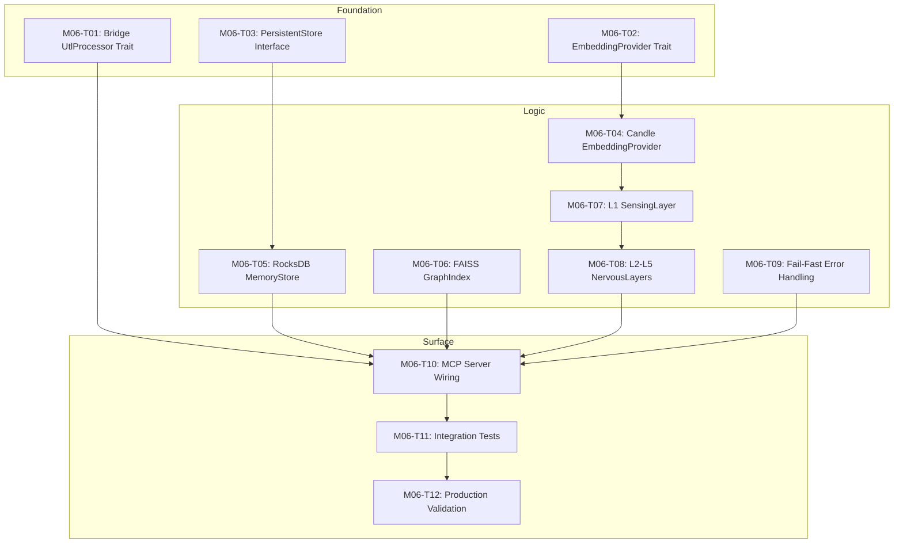

# Module 06: Stub Elimination - Production Reality

## Overview

**Module**: 06 - Stub Elimination & Real Implementation
**Total Tasks**: 12
**Foundation Tasks**: 3
**Logic Tasks**: 6
**Surface Tasks**: 3
**Estimated Duration**: 4 weeks
**Created**: 2026-01-04
**Priority**: CRITICAL

## Problem Statement

Investigation by 5 subagents revealed the system is running entirely on stub implementations:

| Issue | Severity | Location |
|-------|----------|----------|
| ~~Real UtlProcessor doesn't implement core trait~~ | ~~CRITICAL~~ | ~~`context-graph-utl` vs `context-graph-core`~~ **RESOLVED: M06-T01** |
| ~~Fake embeddings `vec![0.1; 1536]` in production~~ | ~~CRITICAL~~ | ~~`handlers/tools.rs`, `handlers/memory.rs`~~ **RESOLVED: M06-T02** |
| InMemoryStore returns 0.5 similarity for ALL | CRITICAL | `stubs/memory_store_stub.rs` |
| StubUtlProcessor uses hash-based fake metrics | CRITICAL | `stubs/utl_stub.rs` |
| 5 NervousLayer implementations are all stubs | HIGH | `stubs/layers_stub.rs` |
| 100+ silent `.unwrap_or()` fallbacks | HIGH | Throughout codebase |
| Production server instantiates stubs | CRITICAL | `server.rs:34` |

**Constitution Reference**: AP-007 forbids stub data in production.

## Dependency Graph



## Execution Order

| # | Task ID | Title | Layer | Depends On | Status | Priority |
|---|---------|-------|-------|------------|--------|----------|
| 1 | [M06-T01](M06-T01.md) | Bridge UtlProcessor Trait to Real Implementation | foundation | - | Complete | critical |
| 2 | [M06-T02](M06-T02.md) | Define EmbeddingProvider Trait & Factory | foundation | - | Complete | critical |
| 3 | [M06-T03](M06-T03.md) | Define PersistentMemoryStore Interface | foundation | - | Complete | critical |
| 4 | [M06-T04](M06-T04.md) | Implement CandleEmbeddingProvider (384D MiniLM in core) | logic | T02 | Ready | critical |
| 5 | [M06-T05](M06-T05.md) | Implement RocksDB MemoryStore | logic | T03 | Ready | high |
| 6 | [M06-T06](M06-T06.md) | Implement FAISS GraphIndex | logic | - | Ready | high |
| 7 | [M06-T07](M06-T07.md) | Implement Real SensingLayer (L1) | logic | T04 | Blocked | high |
| 8 | [M06-T08](M06-T08.md) | Implement Real L2-L5 NervousLayers | logic | T07 | Blocked | medium |
| 9 | [M06-T09](M06-T09.md) | Replace Silent Fallbacks with Fail-Fast | logic | - | Ready | high |
| 10 | [M06-T10](M06-T10.md) | Wire MCP Server to Real Implementations | surface | T01,T04,T05,T06,T08,T09 | Blocked | critical |
| 11 | [M06-T11](M06-T11.md) | Create Integration Tests with Real Data | surface | T10 | Blocked | high |
| 12 | [M06-T12](M06-T12.md) | Production Validation & Stub Audit | surface | T11 | Blocked | critical |

## Status Legend

- Ready - Can be started now (no dependencies or all satisfied)
- Blocked - Waiting on dependencies
- In Progress - Currently being worked on
- Complete - Finished and verified
- Failed - Needs revision

## Critical Path

The longest dependency chain determining minimum completion time:

```
M06-T02 → M06-T04 → M06-T07 → M06-T08 → M06-T10 → M06-T11 → M06-T12
```

## Parallel Opportunities

Tasks that can execute simultaneously:

- **Batch 1 (Foundation)**: M06-T01, M06-T02, M06-T03 (COMPLETE)
- **Batch 2 (Early Logic)**: M06-T06, M06-T09 (independent of each other)
- **Batch 3 (Logic)**: M06-T04, M06-T05 (both depend only on foundation)

## Root Cause Analysis

### Why This Happened

1. **Phase 0 "Ghost System" Scope Creep**: The constitution specifies Phase 0 as "MCP interface, SQLite, external embed, mocked UTL, synthetic data" - stubs were intentional but should have been flagged for removal.

2. **Trait/Implementation Divergence**: The `context_graph_core::traits::UtlProcessor` trait was designed with an async API, but `context_graph_utl::processor::UtlProcessor` was implemented synchronously without implementing the core trait.

3. **No Integration Tests with Real Data**: All tests passed because they used `StubUtlProcessor::new()` which returns deterministic hash-based values.

4. **Silent Fallback Culture**: The codebase adopted `.unwrap_or()` patterns that mask failures rather than surfacing them.

### Prevention Measures

- [ ] Add CI check: `grep -r "StubUtlProcessor" --include="*.rs" src/` must return 0 in production builds
- [ ] Add CI check: No `vec![0.1; 1536]` fake embeddings in handlers/
- [ ] Require feature flag `#[cfg(feature = "stub")]` for all stub code
- [ ] Integration tests must use real implementations

## Quality Gates

| Gate | Criteria | Status |
|------|----------|--------|
| Foundation Complete | T01-T03 complete, traits compile | COMPLETE |
| Embeddings Real | No `vec![0.1; 1536]` in handlers/ | PENDING |
| Storage Real | InMemoryStore replaced with RocksDB | PENDING |
| UTL Real | StubUtlProcessor removed from server.rs | PENDING |
| Layers Real | All 5 NervousLayers have real implementations | PENDING |
| No Silent Fallbacks | `grep -c "unwrap_or" src/` reduced by 80% | PENDING |
| Integration Tests | All tests pass with real implementations | PENDING |
| Production Validated | Zero stub code in non-test paths | PENDING |

## Performance Targets (from constitution.yaml)

| Operation | Target | Current (Stub) |
|-----------|--------|----------------|
| Single Embed | <10ms | N/A (fake) |
| Batch Embed (64) | <50ms | N/A (fake) |
| FAISS search (1M) | <2ms | N/A (brute force) |
| Hopfield cache | <1ms | N/A (no-op) |
| inject_context P95 | <25ms | Unknown |

## Specification References

- `constitution.yaml:73-89` - Coding rules and anti-patterns (AP-007: no stub data)
- `constitution.yaml:108-130` - Performance budgets
- `constitution.yaml:187-194` - 5-Layer Bio-Nervous System
- `contextprd.md:49-72` - UTL Core and Johari Quadrants
- `contextprd.md:83-101` - 12-Model Embedding Pipeline

---

*Index created: 2026-01-04*
*Module: 06 - Stub Elimination*
*Severity: CRITICAL - Production is running on fake data*
