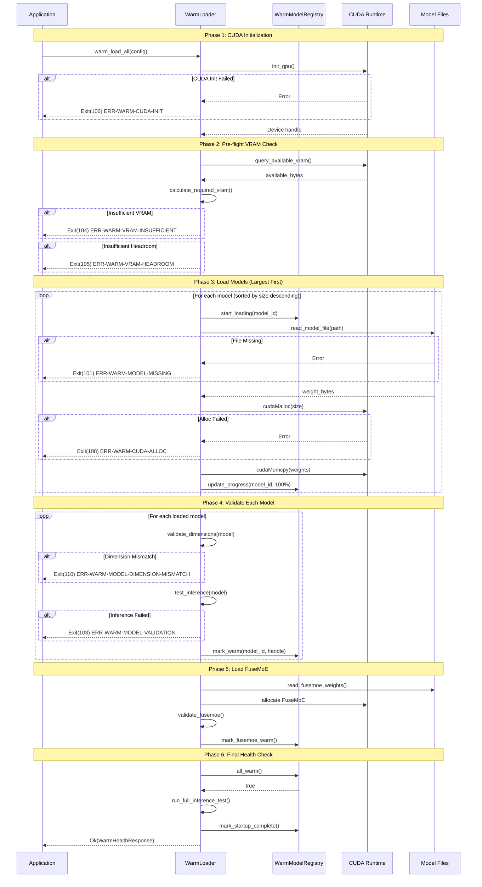

# Warm Model Loading System - Technical Specification

```yaml
spec_id: TECH-WARM-LOADING
version: 1.0
status: draft
functional_spec_ref: SPEC-WARM-LOADING
created: 2026-01-03
author: Technical Spec Agent #2
```

## 1. Module Architecture

### 1.1 Directory Structure

```
crates/context-graph-embeddings/src/warm/
    mod.rs              # Public API re-exports
    registry.rs         # WarmModelRegistry implementation
    loader.rs           # WarmLoader - startup loading orchestrator
    health.rs           # Health check API implementation
    error.rs            # WarmError types and exit codes
    config.rs           # WarmConfig configuration struct
    handle.rs           # ModelHandle - opaque VRAM reference
    state.rs            # WarmModelState enum
    validation.rs       # Model dimension/integrity validation
    diagnostics.rs      # Diagnostic dump generation
```

### 1.2 Module Hierarchy

```
warm/
    mod.rs
    +-- registry.rs      (depends on: handle, state, error)
    +-- loader.rs        (depends on: registry, config, validation, error)
    +-- health.rs        (depends on: registry, handle)
    +-- error.rs         (no internal deps)
    +-- config.rs        (no internal deps)
    +-- handle.rs        (depends on: error)
    +-- state.rs         (no internal deps)
    +-- validation.rs    (depends on: error, handle)
    +-- diagnostics.rs   (depends on: registry, error, config)
```

### 1.3 Integration Points

| Existing Module | Integration Purpose | Requirement Reference |
|-----------------|---------------------|----------------------|
| `gpu/device/core.rs` | CUDA context initialization via `init_gpu()` | REQ-WARM-010 |
| `gpu/memory/budget.rs` | Memory budget configuration (`MemoryBudget`) | REQ-WARM-012 |
| `gpu/memory/pool.rs` | VRAM allocation tracking (`GpuMemoryPool`) | REQ-WARM-004, REQ-WARM-005 |
| `gpu/memory/tracker.rs` | Named allocation tracking (`VramTracker`) | REQ-WARM-013 |
| `models/memory_tracker/core.rs` | Per-model memory tracking (`MemoryTracker`) | REQ-WARM-012 |
| `traits/model_factory/trait_def.rs` | Factory pattern for model creation (`ModelFactory`) | REQ-WARM-001 |
| `traits/model_factory/memory.rs` | Memory estimates per model | REQ-WARM-012, REQ-WARM-013 |
| `fusion/gpu_fusion/expert.rs` | FuseMoE GPU expert weights (`GpuExpert`) | REQ-WARM-002 |
| `types/model_id/core.rs` | Model identification (`ModelId`) | REQ-WARM-001 |
| `error/types.rs` | Error type integration (`EmbeddingError`) | REQ-WARM-008-011 |

---

## 2. Data Structures

### 2.1 WarmModelState

```rust
// File: warm/state.rs

/// State machine for warm-loaded models.
///
/// State transitions:
/// ```text
/// Pending --> Loading --> Validating --> Warm
///               |             |
///               v             v
///            Failed        Failed
/// ```
#[derive(Debug, Clone, Copy, PartialEq, Eq, Hash)]
pub enum WarmModelState {
    /// Model queued for loading but not yet started.
    Pending,
    /// Model weights actively being loaded into VRAM.
    Loading {
        /// Progress percentage (0-100).
        progress_percent: u8,
        /// Bytes loaded so far.
        bytes_loaded: usize,
    },
    /// Model loaded, validation in progress.
    Validating,
    /// Model fully loaded, validated, and ready for inference.
    Warm,
    /// Model loading or validation failed.
    Failed {
        /// Error category code (matches exit codes 101-110).
        error_code: u16,
        /// Human-readable error message.
        error_message: String,
    },
}

impl WarmModelState {
    /// Returns true if model is ready for inference.
    #[inline]
    pub const fn is_warm(&self) -> bool {
        matches!(self, Self::Warm)
    }

    /// Returns true if model is in a terminal failure state.
    #[inline]
    pub const fn is_failed(&self) -> bool {
        matches!(self, Self::Failed { .. })
    }

    /// Returns true if model is still loading.
    #[inline]
    pub const fn is_loading(&self) -> bool {
        matches!(self, Self::Pending | Self::Loading { .. } | Self::Validating)
    }
}
```

### 2.2 ModelHandle

```rust
// File: warm/handle.rs

use std::ptr::NonNull;

/// Opaque handle to a model's VRAM allocation.
///
/// # Safety
///
/// The VRAM address is only valid while the model is in `Warm` state.
/// Do NOT dereference after the model is unloaded.
///
/// # Memory Layout
///
/// ```text
/// +-------------------+
/// | vram_base_ptr     | --> GPU device memory (cudaMalloc'd)
/// | allocation_bytes  | --> Total bytes allocated
/// | device_ordinal    | --> CUDA device ID (typically 0)
/// | allocation_flags  | --> Non-evictable, no UVM
/// +-------------------+
/// ```
#[derive(Debug)]
pub struct ModelHandle {
    /// Base pointer to VRAM allocation (from cudaMalloc).
    /// This is a GPU device pointer, NOT a host pointer.
    vram_base_ptr: u64,

    /// Total bytes allocated in VRAM.
    allocation_bytes: usize,

    /// CUDA device ordinal (default 0).
    device_ordinal: u32,

    /// Allocation timestamp (for debugging).
    allocated_at: std::time::Instant,

    /// Model checksum (SHA256 of weights, truncated to 64 bits).
    weight_checksum: u64,
}

impl ModelHandle {
    /// Create a new model handle after successful VRAM allocation.
    ///
    /// # Arguments
    /// * `vram_ptr` - Raw GPU pointer from cudaMalloc (as u64)
    /// * `bytes` - Allocation size in bytes
    /// * `device` - CUDA device ordinal
    /// * `checksum` - Weight integrity checksum
    pub fn new(
        vram_ptr: u64,
        bytes: usize,
        device: u32,
        checksum: u64,
    ) -> Self {
        Self {
            vram_base_ptr: vram_ptr,
            allocation_bytes: bytes,
            device_ordinal: device,
            allocated_at: std::time::Instant::now(),
            weight_checksum: checksum,
        }
    }

    /// Get VRAM base pointer as u64 (for health check reporting).
    ///
    /// Format: "0x{:016x}" for display.
    #[inline]
    pub fn vram_address(&self) -> u64 {
        self.vram_base_ptr
    }

    /// Get allocation size in bytes.
    #[inline]
    pub fn allocation_bytes(&self) -> usize {
        self.allocation_bytes
    }

    /// Get CUDA device ordinal.
    #[inline]
    pub fn device_ordinal(&self) -> u32 {
        self.device_ordinal
    }

    /// Get weight checksum for integrity verification.
    #[inline]
    pub fn weight_checksum(&self) -> u64 {
        self.weight_checksum
    }

    /// Get time since allocation (for health metrics).
    pub fn uptime(&self) -> std::time::Duration {
        self.allocated_at.elapsed()
    }
}
```

### 2.3 WarmHealthStatus

```rust
// File: warm/health.rs (partial - data structures)

use serde::{Deserialize, Serialize};

/// Health status for a single model.
#[derive(Debug, Clone, Serialize, Deserialize)]
pub struct ModelHealthStatus {
    /// Model identifier (e.g., "E1_Semantic").
    pub model_id: String,

    /// Current state: "warm", "loading", "failed".
    pub status: String,

    /// VRAM address as hex string (e.g., "0x7f8b00000000").
    pub vram_address: String,

    /// Allocation size in bytes.
    pub allocation_bytes: usize,

    /// Last test inference latency in microseconds.
    #[serde(skip_serializing_if = "Option::is_none")]
    pub last_inference_latency_us: Option<u64>,

    /// Whether test inference passed.
    pub test_inference_passed: bool,

    /// Error message if status is "failed".
    #[serde(skip_serializing_if = "Option::is_none")]
    pub error_message: Option<String>,
}

/// Health status for FuseMoE layer.
#[derive(Debug, Clone, Serialize, Deserialize)]
pub struct FuseMoEHealthStatus {
    /// Current state.
    pub status: String,

    /// VRAM address.
    pub vram_address: String,

    /// Total allocation bytes.
    pub allocation_bytes: usize,

    /// Gating network weights loaded.
    pub gating_network_loaded: bool,

    /// Output projection layer loaded.
    pub output_projection_loaded: bool,

    /// Test fusion passed.
    pub test_fusion_passed: bool,
}

/// GPU hardware information.
#[derive(Debug, Clone, Serialize, Deserialize)]
pub struct GpuHealthInfo {
    /// GPU name (e.g., "NVIDIA GeForce RTX 5090").
    pub name: String,

    /// Total VRAM in bytes.
    pub vram_total_bytes: u64,

    /// Used VRAM in bytes.
    pub vram_used_bytes: u64,

    /// Free VRAM in bytes.
    pub vram_free_bytes: u64,

    /// Compute capability (e.g., "12.0").
    pub compute_capability: String,

    /// Driver version.
    pub driver_version: String,

    /// CUDA runtime version.
    pub cuda_version: String,
}

/// Performance metrics.
#[derive(Debug, Clone, Serialize, Deserialize)]
pub struct WarmMetrics {
    /// Total VRAM used by all models.
    pub total_model_vram_bytes: u64,

    /// Startup duration in milliseconds.
    pub startup_duration_ms: u64,

    /// First inference latency after startup.
    pub first_inference_latency_ms: f64,

    /// Steady-state mean latency (from requests 100-200).
    pub steady_state_latency_mean_ms: f64,
}

/// Complete health check response (matches Appendix D).
#[derive(Debug, Clone, Serialize, Deserialize)]
pub struct WarmHealthResponse {
    /// Overall status: "healthy", "degraded", "unhealthy", "loading".
    pub status: String,

    /// ISO 8601 timestamp.
    pub timestamp: String,

    /// GPU information.
    pub gpu: GpuHealthInfo,

    /// Per-model health status.
    pub models: Vec<ModelHealthStatus>,

    /// FuseMoE layer status.
    pub fusemoe: FuseMoEHealthStatus,

    /// Performance metrics.
    pub metrics: WarmMetrics,
}
```

### 2.4 WarmConfig

```rust
// File: warm/config.rs

use std::path::PathBuf;

/// Configuration for the warm loading system.
///
/// # Environment Variable Overrides
///
/// | Field | Environment Variable | Default |
/// |-------|---------------------|---------|
/// | vram_budget_bytes | `WARM_VRAM_BUDGET_BYTES` | 25,769,803,776 (24GB) |
/// | vram_headroom_bytes | `WARM_VRAM_HEADROOM_BYTES` | 8,589,934,592 (8GB) |
/// | model_weights_path | `WARM_MODEL_WEIGHTS_PATH` | "./models" |
/// | diagnostic_dump_path | `WARM_DIAGNOSTIC_DUMP_PATH` | "/var/log/context-graph" |
/// | cuda_device_id | `CUDA_VISIBLE_DEVICES` | 0 |
/// | enable_test_inference | `WARM_ENABLE_TEST_INFERENCE` | true |
/// | max_load_time_per_model_ms | `WARM_MAX_LOAD_TIME_MS` | 30,000 (30s) |
#[derive(Debug, Clone)]
pub struct WarmConfig {
    /// Maximum VRAM for model weights (default: 24GB).
    pub vram_budget_bytes: usize,

    /// Reserved VRAM for working memory (default: 8GB).
    pub vram_headroom_bytes: usize,

    /// Path to model weight files.
    pub model_weights_path: PathBuf,

    /// Path for diagnostic dump files.
    pub diagnostic_dump_path: PathBuf,

    /// CUDA device ID to use.
    pub cuda_device_id: u32,

    /// Whether to run test inference during health check.
    pub enable_test_inference: bool,

    /// Maximum time (ms) to load a single model.
    pub max_load_time_per_model_ms: u64,

    /// Quantization mode for loading.
    pub quantization: QuantizationMode,
}

/// Quantization modes for model loading.
#[derive(Debug, Clone, Copy, PartialEq, Eq)]
pub enum QuantizationMode {
    /// Full precision (FP32) - ~7.2GB total.
    Fp32,
    /// Half precision (FP16) - ~3.6GB total (recommended).
    Fp16,
    /// Quarter precision (FP8) - ~1.8GB total.
    Fp8,
}

impl Default for WarmConfig {
    fn default() -> Self {
        const GB: usize = 1024 * 1024 * 1024;
        Self {
            vram_budget_bytes: 24 * GB,
            vram_headroom_bytes: 8 * GB,
            model_weights_path: PathBuf::from("./models"),
            diagnostic_dump_path: PathBuf::from("/var/log/context-graph"),
            cuda_device_id: 0,
            enable_test_inference: true,
            max_load_time_per_model_ms: 30_000,
            quantization: QuantizationMode::Fp16,
        }
    }
}

impl WarmConfig {
    /// Load configuration from environment variables.
    pub fn from_env() -> Self {
        let mut config = Self::default();

        if let Ok(val) = std::env::var("WARM_VRAM_BUDGET_BYTES") {
            if let Ok(bytes) = val.parse::<usize>() {
                config.vram_budget_bytes = bytes;
            }
        }

        if let Ok(val) = std::env::var("WARM_VRAM_HEADROOM_BYTES") {
            if let Ok(bytes) = val.parse::<usize>() {
                config.vram_headroom_bytes = bytes;
            }
        }

        if let Ok(val) = std::env::var("WARM_MODEL_WEIGHTS_PATH") {
            config.model_weights_path = PathBuf::from(val);
        }

        if let Ok(val) = std::env::var("WARM_DIAGNOSTIC_DUMP_PATH") {
            config.diagnostic_dump_path = PathBuf::from(val);
        }

        if let Ok(val) = std::env::var("CUDA_VISIBLE_DEVICES") {
            if let Ok(id) = val.parse::<u32>() {
                config.cuda_device_id = id;
            }
        }

        if let Ok(val) = std::env::var("WARM_ENABLE_TEST_INFERENCE") {
            config.enable_test_inference = val.to_lowercase() == "true";
        }

        if let Ok(val) = std::env::var("WARM_MAX_LOAD_TIME_MS") {
            if let Ok(ms) = val.parse::<u64>() {
                config.max_load_time_per_model_ms = ms;
            }
        }

        config
    }

    /// Total VRAM required for target GPU (budget + headroom).
    pub fn total_vram_required(&self) -> usize {
        self.vram_budget_bytes + self.vram_headroom_bytes
    }

    /// Validate configuration is consistent.
    pub fn validate(&self) -> Result<(), WarmError> {
        if self.vram_budget_bytes == 0 {
            return Err(WarmError::InvalidConfig {
                field: "vram_budget_bytes".into(),
                reason: "must be > 0".into(),
            });
        }

        if !self.model_weights_path.exists() {
            return Err(WarmError::InvalidConfig {
                field: "model_weights_path".into(),
                reason: format!("path does not exist: {:?}", self.model_weights_path),
            });
        }

        Ok(())
    }
}
```

### 2.5 WarmModelRegistry

```rust
// File: warm/registry.rs

use std::collections::HashMap;
use std::sync::{Arc, RwLock};
use crate::types::ModelId;

use super::{ModelHandle, WarmModelState, WarmError};

/// Entry for a single model in the registry.
#[derive(Debug)]
pub struct WarmModelEntry {
    /// Current state of the model.
    pub state: WarmModelState,

    /// VRAM handle (only valid when state == Warm).
    pub handle: Option<ModelHandle>,

    /// Expected VRAM size in bytes.
    pub expected_bytes: usize,

    /// Expected output dimension.
    pub expected_dimension: usize,

    /// Loading started timestamp.
    pub load_started: Option<std::time::Instant>,

    /// Loading completed timestamp.
    pub load_completed: Option<std::time::Instant>,
}

/// Central registry tracking all warm-loaded models.
///
/// # Thread Safety
///
/// The registry is wrapped in `Arc<RwLock<>>` for concurrent access.
/// Read operations (health check) use read locks.
/// Write operations (loading, state updates) use write locks.
///
/// # Invariants
///
/// 1. Once a model enters `Warm` state, it NEVER leaves until process exit.
/// 2. If any model enters `Failed` state during startup, all models are unloaded.
/// 3. The registry tracks exactly 12 embedding models + 1 FuseMoE.
#[derive(Debug)]
pub struct WarmModelRegistry {
    /// Embedding model entries (E1-E12).
    models: HashMap<ModelId, WarmModelEntry>,

    /// FuseMoE layer entry.
    fusemoe: Option<WarmModelEntry>,

    /// System startup timestamp.
    startup_started: std::time::Instant,

    /// System ready timestamp (all models warm).
    startup_completed: Option<std::time::Instant>,

    /// Total VRAM allocated across all models.
    total_vram_allocated: usize,
}

/// Thread-safe handle to the registry.
pub type SharedWarmRegistry = Arc<RwLock<WarmModelRegistry>>;

impl WarmModelRegistry {
    /// Create a new empty registry.
    pub fn new() -> Self {
        Self {
            models: HashMap::with_capacity(12),
            fusemoe: None,
            startup_started: std::time::Instant::now(),
            startup_completed: None,
            total_vram_allocated: 0,
        }
    }

    /// Create a shared registry wrapped in Arc<RwLock>.
    pub fn shared() -> SharedWarmRegistry {
        Arc::new(RwLock::new(Self::new()))
    }

    /// Register a model entry (called before loading).
    pub fn register_model(
        &mut self,
        model_id: ModelId,
        expected_bytes: usize,
    ) -> Result<(), WarmError> {
        if self.models.contains_key(&model_id) {
            return Err(WarmError::ModelAlreadyRegistered {
                model_id: model_id.as_str().to_string(),
            });
        }

        let entry = WarmModelEntry {
            state: WarmModelState::Pending,
            handle: None,
            expected_bytes,
            expected_dimension: model_id.dimension(),
            load_started: None,
            load_completed: None,
        };

        self.models.insert(model_id, entry);
        Ok(())
    }

    /// Update model state to Loading.
    pub fn start_loading(&mut self, model_id: ModelId) -> Result<(), WarmError> {
        let entry = self.models.get_mut(&model_id)
            .ok_or_else(|| WarmError::ModelNotRegistered {
                model_id: model_id.as_str().to_string(),
            })?;

        entry.state = WarmModelState::Loading {
            progress_percent: 0,
            bytes_loaded: 0,
        };
        entry.load_started = Some(std::time::Instant::now());
        Ok(())
    }

    /// Update loading progress.
    pub fn update_progress(
        &mut self,
        model_id: ModelId,
        progress_percent: u8,
        bytes_loaded: usize,
    ) -> Result<(), WarmError> {
        let entry = self.models.get_mut(&model_id)
            .ok_or_else(|| WarmError::ModelNotRegistered {
                model_id: model_id.as_str().to_string(),
            })?;

        entry.state = WarmModelState::Loading {
            progress_percent,
            bytes_loaded,
        };
        Ok(())
    }

    /// Mark model as warm with handle.
    pub fn mark_warm(
        &mut self,
        model_id: ModelId,
        handle: ModelHandle,
    ) -> Result<(), WarmError> {
        let entry = self.models.get_mut(&model_id)
            .ok_or_else(|| WarmError::ModelNotRegistered {
                model_id: model_id.as_str().to_string(),
            })?;

        self.total_vram_allocated += handle.allocation_bytes();
        entry.state = WarmModelState::Warm;
        entry.handle = Some(handle);
        entry.load_completed = Some(std::time::Instant::now());
        Ok(())
    }

    /// Mark model as failed.
    pub fn mark_failed(
        &mut self,
        model_id: ModelId,
        error_code: u16,
        error_message: String,
    ) -> Result<(), WarmError> {
        let entry = self.models.get_mut(&model_id)
            .ok_or_else(|| WarmError::ModelNotRegistered {
                model_id: model_id.as_str().to_string(),
            })?;

        entry.state = WarmModelState::Failed {
            error_code,
            error_message,
        };
        Ok(())
    }

    /// Check if all models are warm.
    pub fn all_warm(&self) -> bool {
        let models_warm = self.models.values().all(|e| e.state.is_warm());
        let fusemoe_warm = self.fusemoe.as_ref().map(|e| e.state.is_warm()).unwrap_or(false);
        models_warm && fusemoe_warm
    }

    /// Check if any model failed.
    pub fn any_failed(&self) -> bool {
        self.models.values().any(|e| e.state.is_failed())
            || self.fusemoe.as_ref().map(|e| e.state.is_failed()).unwrap_or(false)
    }

    /// Get model entry by ID.
    pub fn get_model(&self, model_id: ModelId) -> Option<&WarmModelEntry> {
        self.models.get(&model_id)
    }

    /// Get FuseMoE entry.
    pub fn get_fusemoe(&self) -> Option<&WarmModelEntry> {
        self.fusemoe.as_ref()
    }

    /// Get total VRAM allocated.
    pub fn total_vram(&self) -> usize {
        self.total_vram_allocated
    }

    /// Get startup duration.
    pub fn startup_duration(&self) -> Option<std::time::Duration> {
        self.startup_completed.map(|t| t.duration_since(self.startup_started))
    }

    /// Mark startup as complete.
    pub fn mark_startup_complete(&mut self) {
        self.startup_completed = Some(std::time::Instant::now());
    }

    /// Get all model IDs in loading order (largest first).
    pub fn loading_order(&self) -> Vec<ModelId> {
        let mut ids: Vec<_> = self.models.keys().copied().collect();
        ids.sort_by(|a, b| {
            let size_a = self.models.get(a).map(|e| e.expected_bytes).unwrap_or(0);
            let size_b = self.models.get(b).map(|e| e.expected_bytes).unwrap_or(0);
            size_b.cmp(&size_a) // Descending order (largest first)
        });
        ids
    }
}
```

---

## 3. Core Traits

### 3.1 WarmLoadable Trait

```rust
// File: warm/mod.rs (trait definition)

use crate::error::EmbeddingResult;
use super::{ModelHandle, WarmConfig, WarmError};

/// Trait for models that can be warm-loaded into VRAM.
///
/// # Contract
///
/// 1. `load_to_vram` MUST allocate using cudaMalloc (not cudaMallocManaged).
/// 2. Allocated memory MUST be non-evictable (protected allocation).
/// 3. `validate` MUST verify output dimensions match expected.
/// 4. `test_inference` MUST run a real inference with known input/output.
///
/// # Thread Safety
///
/// Implementations must be `Send + Sync` for use with `Arc<dyn WarmLoadable>`.
#[async_trait::async_trait]
pub trait WarmLoadable: Send + Sync {
    /// Load model weights from disk into VRAM.
    ///
    /// # Arguments
    /// * `config` - Warm loading configuration
    /// * `progress_callback` - Called with (bytes_loaded, total_bytes)
    ///
    /// # Returns
    /// ModelHandle on success with VRAM allocation details.
    ///
    /// # Errors
    /// - `WarmError::ModelFileMissing` if weights file not found
    /// - `WarmError::ModelLoadFailed` if loading fails
    /// - `WarmError::VramAllocationFailed` if CUDA allocation fails
    async fn load_to_vram(
        &self,
        config: &WarmConfig,
        progress_callback: Box<dyn Fn(usize, usize) + Send>,
    ) -> Result<ModelHandle, WarmError>;

    /// Validate model after loading.
    ///
    /// Checks:
    /// 1. Output dimension matches expected
    /// 2. No NaN/Inf in weight matrices
    /// 3. Test inference produces expected output
    ///
    /// # Returns
    /// Ok(()) if validation passes.
    fn validate(&self, handle: &ModelHandle, expected_dim: usize) -> Result<(), WarmError>;

    /// Run a test inference to verify operational readiness.
    ///
    /// Uses a small fixed input and validates output against known reference.
    ///
    /// # Returns
    /// Inference latency in microseconds.
    fn test_inference(&self, handle: &ModelHandle) -> Result<u64, WarmError>;

    /// Get estimated VRAM size for this model (bytes).
    fn estimated_vram_bytes(&self, quantization: QuantizationMode) -> usize;

    /// Get model identifier string.
    fn model_id(&self) -> &str;
}
```

### 3.2 VramResident Trait

```rust
// File: warm/mod.rs (trait definition)

/// Trait for resources that hold VRAM allocations.
///
/// # Safety
///
/// Implementations MUST ensure:
/// 1. VRAM is allocated via cudaMalloc (device memory, not UVM).
/// 2. Allocations are NOT freed until the trait object is dropped.
/// 3. VRAM pointers remain valid for the lifetime of the object.
pub trait VramResident: Send + Sync {
    /// Get the base VRAM address of this allocation.
    fn vram_address(&self) -> u64;

    /// Get the allocation size in bytes.
    fn vram_bytes(&self) -> usize;

    /// Get the CUDA device ordinal for this allocation.
    fn device_ordinal(&self) -> u32;

    /// Check if the allocation is still valid.
    ///
    /// Returns false if CUDA context was lost or allocation freed.
    fn is_valid(&self) -> bool;
}
```

### 3.3 Trait Bounds for GPU Context

```rust
// Integration with existing gpu/device/core.rs

use candle_core::Device;

/// Extension trait for Device to support warm loading.
pub trait WarmDeviceExt {
    /// Query available VRAM on this device.
    fn available_vram(&self) -> Result<usize, WarmError>;

    /// Query total VRAM on this device.
    fn total_vram(&self) -> Result<usize, WarmError>;

    /// Check if device supports required compute capability.
    fn check_compute_capability(&self, required: (u32, u32)) -> Result<(), WarmError>;

    /// Allocate non-evictable device memory.
    ///
    /// Uses cudaMalloc internally (NOT cudaMallocManaged).
    fn allocate_protected(&self, bytes: usize) -> Result<u64, WarmError>;

    /// Free device memory.
    fn free_protected(&self, ptr: u64) -> Result<(), WarmError>;
}
```

---

## 4. CUDA Integration

### 4.1 Integration with Existing CudaContext

```rust
// Integration points with gpu/device/core.rs

use candle_core::Device;
use crate::gpu::{init_gpu, GPU_DEVICE, GPU_INFO};

impl WarmLoader {
    /// Initialize CUDA context for warm loading.
    ///
    /// Calls the existing `init_gpu()` from gpu/device/core.rs.
    ///
    /// # Errors
    ///
    /// Returns `WarmError::CudaInitFailed` with full diagnostics if:
    /// - No CUDA-capable GPU detected
    /// - Driver incompatible
    /// - GPU in exclusive mode
    fn init_cuda_context(&self) -> Result<&'static Device, WarmError> {
        init_gpu().map_err(|e| WarmError::CudaInitFailed {
            cuda_error: e.to_string(),
            driver_version: self.query_driver_version(),
            gpu_name: self.query_gpu_name(),
        })
    }
}
```

### 4.2 cudaMalloc for Non-Evictable Allocations

```rust
// File: warm/loader.rs (allocation strategy)

/// VRAM allocation strategy for warm-loaded models.
///
/// # Why cudaMalloc, NOT cudaMallocManaged
///
/// | Feature | cudaMalloc | cudaMallocManaged (UVM) |
/// |---------|------------|-------------------------|
/// | Eviction | Never | Can be evicted by OS |
/// | Performance | Optimal | Overhead from page faults |
/// | Address Space | Device only | Unified (slower) |
/// | Residency | Guaranteed | Not guaranteed |
///
/// For warm loading, we MUST use cudaMalloc to guarantee VRAM residency.
///
/// # Memory Pool Isolation
///
/// Model weights and working memory use SEPARATE allocation pools:
///
/// ```text
/// +---------------------+
/// | Model Weights Pool  | <-- cudaMalloc, non-evictable
/// | (3.6GB FP16)        |    (WarmModelRegistry manages)
/// +---------------------+
/// | Working Memory Pool | <-- Can use UVM for flexibility
/// | (8GB headroom)      |    (GpuMemoryPool manages)
/// +---------------------+
/// | System Reserved     |
/// | (500MB overhead)    |
/// +---------------------+
/// ```
impl WarmLoader {
    /// Allocate device memory for model weights.
    ///
    /// # Safety
    ///
    /// This allocates raw CUDA device memory. The caller is responsible
    /// for freeing the allocation when no longer needed.
    fn allocate_model_vram(&self, bytes: usize) -> Result<u64, WarmError> {
        // In practice, this uses cudarc or candle's CUDA backend
        // Here we show the conceptual interface

        #[cfg(feature = "cuda")]
        {
            use cudarc::driver::CudaDevice;

            let device = CudaDevice::new(self.config.cuda_device_id as usize)
                .map_err(|e| WarmError::CudaAllocFailed {
                    requested_bytes: bytes,
                    cuda_error: e.to_string(),
                })?;

            // Allocate device memory (NOT managed memory)
            let ptr = device.alloc::<u8>(bytes)
                .map_err(|e| WarmError::CudaAllocFailed {
                    requested_bytes: bytes,
                    cuda_error: e.to_string(),
                })?;

            // Return raw pointer as u64
            Ok(ptr.device_ptr() as u64)
        }

        #[cfg(not(feature = "cuda"))]
        {
            Err(WarmError::CudaNotAvailable)
        }
    }
}
```

### 4.3 Memory Pool Isolation

```rust
// Integration with gpu/memory/pool.rs

/// Extended memory pool for warm loading.
///
/// Separates model weight allocations from working memory.
pub struct WarmMemoryPools {
    /// Pool for model weights (non-evictable).
    model_pool: GpuMemoryPool,

    /// Pool for working memory (can use headroom).
    working_pool: GpuMemoryPool,

    /// Configuration.
    config: WarmConfig,
}

impl WarmMemoryPools {
    /// Create memory pools for RTX 5090 (32GB).
    pub fn rtx_5090(config: WarmConfig) -> Self {
        Self {
            model_pool: GpuMemoryPool::new(config.vram_budget_bytes),
            working_pool: GpuMemoryPool::new(config.vram_headroom_bytes),
            config,
        }
    }

    /// Allocate from model pool (non-evictable).
    pub fn allocate_model(&self, name: &str, bytes: usize) -> Result<(), WarmError> {
        self.model_pool.allocate(name, bytes)
            .map_err(|e| WarmError::VramAllocationFailed {
                requested_bytes: bytes,
                available_bytes: self.model_pool.available(),
                error: e.to_string(),
            })
    }

    /// Allocate from working pool (can fail without affecting models).
    pub fn allocate_working(&self, name: &str, bytes: usize) -> Result<(), WarmError> {
        self.working_pool.allocate(name, bytes)
            .map_err(|e| WarmError::WorkingMemoryExhausted {
                requested_bytes: bytes,
                available_bytes: self.working_pool.available(),
            })
    }
}
```

### 4.4 Querying VRAM Addresses

```rust
// File: warm/health.rs (VRAM address query)

impl WarmHealthChecker {
    /// Query VRAM address for a model handle.
    ///
    /// # Returns
    /// VRAM address formatted as hex string (e.g., "0x7f8b00000000").
    fn format_vram_address(handle: &ModelHandle) -> String {
        format!("0x{:016x}", handle.vram_address())
    }

    /// Verify VRAM address is still valid.
    ///
    /// Queries CUDA to ensure the pointer is in valid device memory.
    fn verify_vram_address(&self, handle: &ModelHandle) -> Result<bool, WarmError> {
        #[cfg(feature = "cuda")]
        {
            use cudarc::driver::CudaDevice;

            let device = CudaDevice::new(handle.device_ordinal() as usize)
                .map_err(|e| WarmError::CudaQueryFailed {
                    error: e.to_string(),
                })?;

            // Query pointer attributes to verify it's valid device memory
            // This is a low-level CUDA API call
            let ptr = handle.vram_address() as *const u8;

            // In practice, use cuMemGetAddressRange or similar
            // Here we assume the allocation is valid if no error occurred
            Ok(true)
        }

        #[cfg(not(feature = "cuda"))]
        Ok(false)
    }
}
```

---

## 5. Startup Sequence

### 5.1 Detailed Startup Flow



### 5.2 Loading Order (REQ-WARM-001)

Models are loaded in **size-descending order** to fail fast if VRAM is insufficient:

```rust
// File: warm/loader.rs

/// Get models in optimal loading order.
///
/// Largest models first to detect VRAM issues early.
pub fn optimal_loading_order(quantization: QuantizationMode) -> Vec<(ModelId, usize)> {
    let multiplier = match quantization {
        QuantizationMode::Fp32 => 1.0,
        QuantizationMode::Fp16 => 0.5,
        QuantizationMode::Fp8 => 0.25,
    };

    let mut models: Vec<_> = [
        (ModelId::Multimodal, 1_600_000_000),  // ~1.6GB FP32
        (ModelId::Semantic, 1_400_000_000),     // ~1.4GB FP32
        (ModelId::Causal, 650_000_000),         // ~650MB FP32
        (ModelId::Sparse, 550_000_000),         // ~550MB FP32
        (ModelId::Code, 550_000_000),           // ~550MB FP32
        (ModelId::LateInteraction, 450_000_000), // ~450MB FP32
        (ModelId::Graph, 120_000_000),          // ~120MB FP32
        (ModelId::Entity, 120_000_000),         // ~120MB FP32
        (ModelId::Hdc, 60_000_000),             // ~60MB FP32
        (ModelId::TemporalRecent, 15_000_000),  // ~15MB FP32
        (ModelId::TemporalPeriodic, 15_000_000), // ~15MB FP32
        (ModelId::TemporalPositional, 15_000_000), // ~15MB FP32
    ].iter()
     .map(|(id, bytes)| (*id, (*bytes as f32 * multiplier) as usize))
     .collect();

    // Already sorted by size descending
    models
}
```

---

## 6. Health Check API

### 6.1 Rust Function Signatures

```rust
// File: warm/health.rs

use std::time::Duration;

/// Health check API for the warm loading system.
pub struct WarmHealthChecker {
    registry: SharedWarmRegistry,
    config: WarmConfig,
}

impl WarmHealthChecker {
    /// Create a new health checker.
    pub fn new(registry: SharedWarmRegistry, config: WarmConfig) -> Self {
        Self { registry, config }
    }

    /// Quick health check (no test inference).
    ///
    /// Latency: < 10ms (REQ-WARM-006)
    ///
    /// # Returns
    /// Health response with model states and VRAM info.
    pub fn check_quick(&self) -> Result<WarmHealthResponse, WarmError> {
        let registry = self.registry.read()
            .map_err(|_| WarmError::RegistryLockPoisoned)?;

        let models = self.collect_model_status(&registry)?;
        let fusemoe = self.collect_fusemoe_status(&registry)?;
        let gpu = self.query_gpu_info()?;
        let metrics = self.collect_metrics(&registry)?;

        let status = self.determine_overall_status(&registry);

        Ok(WarmHealthResponse {
            status,
            timestamp: chrono::Utc::now().to_rfc3339(),
            gpu,
            models,
            fusemoe,
            metrics,
        })
    }

    /// Full health check with test inference (REQ-WARM-007).
    ///
    /// Latency: < 100ms
    ///
    /// Runs test inference on each model to verify operational readiness.
    pub fn check_full(&self) -> Result<WarmHealthResponse, WarmError> {
        let mut response = self.check_quick()?;

        // Run test inference on each model
        for model_status in &mut response.models {
            if model_status.status == "warm" {
                match self.run_test_inference_for_model(&model_status.model_id) {
                    Ok(latency_us) => {
                        model_status.last_inference_latency_us = Some(latency_us);
                        model_status.test_inference_passed = true;
                    }
                    Err(e) => {
                        model_status.test_inference_passed = false;
                        model_status.status = "warm_but_failing".to_string();
                        model_status.error_message = Some(e.to_string());
                    }
                }
            }
        }

        // Run test fusion
        if response.fusemoe.status == "warm" {
            match self.run_test_fusion() {
                Ok(_) => {
                    response.fusemoe.test_fusion_passed = true;
                }
                Err(e) => {
                    response.fusemoe.test_fusion_passed = false;
                    response.status = "degraded".to_string();
                }
            }
        }

        Ok(response)
    }

    /// Determine overall health status.
    fn determine_overall_status(&self, registry: &WarmModelRegistry) -> String {
        if registry.all_warm() {
            "healthy".to_string()
        } else if registry.any_failed() {
            "unhealthy".to_string()
        } else {
            "loading".to_string()
        }
    }

    /// Run test inference for a specific model.
    ///
    /// Uses small fixed input and validates output.
    fn run_test_inference_for_model(&self, model_id: &str) -> Result<u64, WarmError> {
        // Test input: "The quick brown fox" tokenized
        let test_input = self.get_test_input(model_id)?;

        let start = std::time::Instant::now();

        // Run inference through the warm-loaded model
        let output = self.run_inference(model_id, &test_input)?;

        let latency_us = start.elapsed().as_micros() as u64;

        // Validate output dimensions
        self.validate_output(model_id, &output)?;

        Ok(latency_us)
    }

    /// Run test fusion through FuseMoE.
    fn run_test_fusion(&self) -> Result<u64, WarmError> {
        // Generate dummy embeddings from each model (zeros for speed)
        // Pass through FuseMoE and verify output dimension is 1536

        let start = std::time::Instant::now();

        // Run fusion
        // ... implementation details ...

        Ok(start.elapsed().as_micros() as u64)
    }
}
```

### 6.2 Test Inference Protocol

```rust
// File: warm/health.rs (test inference protocol)

/// Test inference configuration per model.
struct TestInferenceConfig {
    /// Fixed input text for testing.
    input_text: &'static str,
    /// Expected output dimension.
    expected_dim: usize,
    /// Tolerance for output validation.
    output_tolerance: f32,
}

impl WarmHealthChecker {
    /// Get test inference config for a model.
    fn get_test_config(&self, model_id: &str) -> TestInferenceConfig {
        match model_id {
            "E1_Semantic" => TestInferenceConfig {
                input_text: "The quick brown fox jumps over the lazy dog",
                expected_dim: 1024,
                output_tolerance: 1e-5,
            },
            "E2_TemporalRecent" | "E3_TemporalPeriodic" | "E4_TemporalPositional" => {
                TestInferenceConfig {
                    input_text: "2026-01-03T12:00:00Z", // ISO timestamp
                    expected_dim: 512,
                    output_tolerance: 1e-6,
                }
            },
            "E5_Causal" => TestInferenceConfig {
                input_text: "The quick brown fox",
                expected_dim: 768,
                output_tolerance: 1e-5,
            },
            "E6_Sparse" => TestInferenceConfig {
                input_text: "information retrieval",
                expected_dim: 1536, // After projection
                output_tolerance: 1e-4,
            },
            "E7_Code" => TestInferenceConfig {
                input_text: "def hello(): return 42",
                expected_dim: 768, // After projection
                output_tolerance: 1e-5,
            },
            "E8_Graph" => TestInferenceConfig {
                input_text: "semantic similarity",
                expected_dim: 384,
                output_tolerance: 1e-5,
            },
            "E9_Hdc" => TestInferenceConfig {
                input_text: "hyperdimensional test",
                expected_dim: 1024, // After projection
                output_tolerance: 1e-4,
            },
            "E10_Multimodal" => TestInferenceConfig {
                input_text: "a photo of a cat",
                expected_dim: 768,
                output_tolerance: 1e-5,
            },
            "E11_Entity" => TestInferenceConfig {
                input_text: "Paris France capital",
                expected_dim: 384,
                output_tolerance: 1e-5,
            },
            "E12_LateInteraction" => TestInferenceConfig {
                input_text: "neural information retrieval",
                expected_dim: 128, // Per token
                output_tolerance: 1e-5,
            },
            _ => TestInferenceConfig {
                input_text: "test",
                expected_dim: 1024,
                output_tolerance: 1e-4,
            },
        }
    }
}
```

---

## 7. Error Handling

### 7.1 WarmError Type

```rust
// File: warm/error.rs

use thiserror::Error;

/// Error type for warm loading operations.
///
/// # Exit Code Mapping (REQ-WARM-008 - REQ-WARM-011)
///
/// | Error | Exit Code | Category |
/// |-------|-----------|----------|
/// | ModelFileMissing | 101 | Startup |
/// | ModelLoadFailed | 102 | Startup |
/// | ModelValidationFailed | 103 | Startup |
/// | VramInsufficientTotal | 104 | Startup |
/// | VramInsufficientHeadroom | 105 | Startup |
/// | CudaInitFailed | 106 | Startup |
/// | CudaCapabilityInsufficient | 107 | Startup |
/// | CudaAllocFailed | 108 | Runtime |
/// | CudaContextLost | 109 | Runtime |
/// | ModelDimensionMismatch | 110 | Startup |
#[derive(Debug, Error)]
pub enum WarmError {
    // === Exit Code 101 ===
    #[error("Model file missing: {model_id} not found at {path}")]
    ModelFileMissing {
        model_id: String,
        path: String,
    },

    // === Exit Code 102 ===
    #[error("Model load failed for {model_id}: {reason}")]
    ModelLoadFailed {
        model_id: String,
        reason: String,
        bytes_read: usize,
        file_size: usize,
    },

    // === Exit Code 103 ===
    #[error("Model validation failed for {model_id}: {reason}")]
    ModelValidationFailed {
        model_id: String,
        reason: String,
        expected_output: Option<String>,
        actual_output: Option<String>,
    },

    // === Exit Code 104 ===
    #[error("Insufficient VRAM: required {required_gb:.2}GB, available {available_gb:.2}GB")]
    VramInsufficientTotal {
        required_bytes: usize,
        available_bytes: usize,
        required_gb: f64,
        available_gb: f64,
        model_breakdown: Vec<(String, usize)>,
    },

    // === Exit Code 105 ===
    #[error("Insufficient headroom: models {model_gb:.2}GB, available {available_gb:.2}GB, headroom required {headroom_gb:.2}GB")]
    VramInsufficientHeadroom {
        model_bytes: usize,
        available_bytes: usize,
        headroom_required: usize,
        model_gb: f64,
        available_gb: f64,
        headroom_gb: f64,
    },

    // === Exit Code 106 ===
    #[error("CUDA initialization failed: {cuda_error}")]
    CudaInitFailed {
        cuda_error: String,
        driver_version: String,
        gpu_name: String,
    },

    // === Exit Code 107 ===
    #[error("GPU compute capability {actual_cc} insufficient, required {required_cc}")]
    CudaCapabilityInsufficient {
        actual_cc: String,
        required_cc: String,
        gpu_name: String,
    },

    // === Exit Code 108 ===
    #[error("CUDA allocation failed: requested {requested_bytes} bytes")]
    CudaAllocFailed {
        requested_bytes: usize,
        cuda_error: String,
        vram_free: Option<usize>,
        allocation_history: Vec<String>,
    },

    // === Exit Code 109 ===
    #[error("CUDA context lost: {reason}")]
    CudaContextLost {
        reason: String,
        last_successful_op: String,
    },

    // === Exit Code 110 ===
    #[error("Model dimension mismatch for {model_id}: expected {expected}, got {actual}")]
    ModelDimensionMismatch {
        model_id: String,
        expected: usize,
        actual: usize,
    },

    // === Non-exit errors ===
    #[error("Model already registered: {model_id}")]
    ModelAlreadyRegistered { model_id: String },

    #[error("Model not registered: {model_id}")]
    ModelNotRegistered { model_id: String },

    #[error("Invalid configuration: {field} - {reason}")]
    InvalidConfig { field: String, reason: String },

    #[error("Registry lock poisoned")]
    RegistryLockPoisoned,

    #[error("Working memory exhausted: requested {requested_bytes}, available {available_bytes}")]
    WorkingMemoryExhausted {
        requested_bytes: usize,
        available_bytes: usize,
    },

    #[error("CUDA not available (feature disabled)")]
    CudaNotAvailable,

    #[error("CUDA query failed: {error}")]
    CudaQueryFailed { error: String },

    #[error("Diagnostic dump failed: {reason}")]
    DiagnosticDumpFailed { reason: String },

    #[error("Timeout loading model {model_id} after {timeout_ms}ms")]
    LoadTimeout { model_id: String, timeout_ms: u64 },
}

impl WarmError {
    /// Get exit code for this error.
    pub fn exit_code(&self) -> i32 {
        match self {
            Self::ModelFileMissing { .. } => 101,
            Self::ModelLoadFailed { .. } => 102,
            Self::ModelValidationFailed { .. } => 103,
            Self::VramInsufficientTotal { .. } => 104,
            Self::VramInsufficientHeadroom { .. } => 105,
            Self::CudaInitFailed { .. } => 106,
            Self::CudaCapabilityInsufficient { .. } => 107,
            Self::CudaAllocFailed { .. } => 108,
            Self::CudaContextLost { .. } => 109,
            Self::ModelDimensionMismatch { .. } => 110,
            _ => 1, // Generic error
        }
    }

    /// Check if this is a fatal startup error.
    pub fn is_fatal(&self) -> bool {
        matches!(
            self,
            Self::ModelFileMissing { .. }
                | Self::ModelLoadFailed { .. }
                | Self::ModelValidationFailed { .. }
                | Self::VramInsufficientTotal { .. }
                | Self::VramInsufficientHeadroom { .. }
                | Self::CudaInitFailed { .. }
                | Self::CudaCapabilityInsufficient { .. }
                | Self::CudaAllocFailed { .. }
                | Self::CudaContextLost { .. }
                | Self::ModelDimensionMismatch { .. }
        )
    }
}
```

### 7.2 Diagnostic Dump Format (REQ-WARM-015)

```rust
// File: warm/diagnostics.rs

use serde::{Deserialize, Serialize};
use std::collections::HashMap;

/// Complete diagnostic dump for startup failures.
#[derive(Debug, Serialize, Deserialize)]
pub struct DiagnosticDump {
    /// Human-readable summary at top.
    pub summary: String,

    /// Timestamp of dump generation.
    pub timestamp: String,

    /// Error that triggered the dump.
    pub error: ErrorDetails,

    /// GPU state at time of failure.
    pub gpu_state: GpuDiagnostics,

    /// Model loading progress.
    pub model_progress: Vec<ModelLoadProgress>,

    /// Configuration in effect.
    pub configuration: ConfigDump,

    /// Recent allocation history.
    pub allocation_history: Vec<AllocationRecord>,

    /// System information.
    pub system_info: SystemInfo,
}

#[derive(Debug, Serialize, Deserialize)]
pub struct ErrorDetails {
    pub code: i32,
    pub name: String,
    pub message: String,
    pub details: HashMap<String, String>,
}

#[derive(Debug, Serialize, Deserialize)]
pub struct GpuDiagnostics {
    pub device_name: String,
    pub driver_version: String,
    pub cuda_version: String,
    pub compute_capability: String,
    pub vram_total_bytes: u64,
    pub vram_used_bytes: u64,
    pub vram_free_bytes: u64,
    pub temperature_celsius: Option<u32>,
    pub power_usage_watts: Option<u32>,
}

#[derive(Debug, Serialize, Deserialize)]
pub struct ModelLoadProgress {
    pub model_id: String,
    pub state: String,
    pub bytes_loaded: usize,
    pub total_bytes: usize,
    pub progress_percent: u8,
    pub load_duration_ms: Option<u64>,
}

#[derive(Debug, Serialize, Deserialize)]
pub struct AllocationRecord {
    pub timestamp: String,
    pub name: String,
    pub bytes: usize,
    pub success: bool,
    pub vram_after: usize,
}

impl DiagnosticDump {
    /// Write dump to configured path.
    pub fn write_to_file(&self, path: &std::path::Path) -> Result<(), WarmError> {
        let json = serde_json::to_string_pretty(self)
            .map_err(|e| WarmError::DiagnosticDumpFailed {
                reason: format!("JSON serialization failed: {}", e),
            })?;

        std::fs::write(path, &json)
            .map_err(|e| WarmError::DiagnosticDumpFailed {
                reason: format!("Write failed: {}", e),
            })?;

        Ok(())
    }

    /// Write to fallback path if primary fails.
    pub fn write_with_fallback(
        &self,
        primary: &std::path::Path,
        fallback: &std::path::Path,
    ) -> Result<std::path::PathBuf, WarmError> {
        match self.write_to_file(primary) {
            Ok(_) => Ok(primary.to_path_buf()),
            Err(_) => {
                self.write_to_file(fallback)?;
                Ok(fallback.to_path_buf())
            }
        }
    }
}
```

---

## 8. Interface with Existing Code

### 8.1 gpu/memory/budget.rs Integration

```rust
// Extend MemoryBudget for warm loading

impl MemoryBudget {
    /// Create budget optimized for warm loading.
    ///
    /// Reserves more space for model weights vs working memory.
    pub fn for_warm_loading() -> Self {
        const GB: usize = 1024 * 1024 * 1024;
        Self {
            model_weights: 24 * GB, // Increased for all 12 models + FuseMoE
            activation_cache: 4 * GB,
            working_memory: 2 * GB,
            reserved: 2 * GB,
        }
    }
}
```

### 8.2 models/memory_tracker/core.rs Integration

```rust
// Integration with MemoryTracker for warm loading

impl WarmLoader {
    /// Integrate with existing MemoryTracker.
    fn allocate_with_tracking(
        &self,
        model_id: ModelId,
        bytes: usize,
        tracker: &mut MemoryTracker,
    ) -> Result<(), WarmError> {
        // Check budget before allocation
        if !tracker.can_allocate(bytes) {
            return Err(WarmError::VramInsufficientTotal {
                required_bytes: bytes,
                available_bytes: tracker.remaining(),
                required_gb: bytes as f64 / (1024.0 * 1024.0 * 1024.0),
                available_gb: tracker.remaining() as f64 / (1024.0 * 1024.0 * 1024.0),
                model_breakdown: vec![],
            });
        }

        // Allocate in tracker
        tracker.allocate(model_id, bytes)
            .map_err(|e| WarmError::ModelLoadFailed {
                model_id: model_id.as_str().to_string(),
                reason: e.to_string(),
                bytes_read: 0,
                file_size: bytes,
            })?;

        Ok(())
    }
}
```

### 8.3 fusion/gpu_fusion/expert.rs Integration

```rust
// Integration with GpuExpert for FuseMoE warm loading

impl WarmLoader {
    /// Load FuseMoE experts into VRAM.
    async fn load_fusemoe(
        &self,
        config: &WarmConfig,
    ) -> Result<Vec<GpuExpert>, WarmError> {
        const NUM_EXPERTS: usize = 8;
        const INPUT_DIM: usize = 8320; // Concatenated embeddings
        const HIDDEN_DIM: usize = 4096;
        const OUTPUT_DIM: usize = 1536;

        let device = self.get_device()?;
        let mut experts = Vec::with_capacity(NUM_EXPERTS);

        for expert_id in 0..NUM_EXPERTS {
            let expert = GpuExpert::new(
                expert_id,
                INPUT_DIM,
                HIDDEN_DIM,
                OUTPUT_DIM,
                &device,
            ).map_err(|e| WarmError::ModelLoadFailed {
                model_id: format!("FuseMoE_Expert_{}", expert_id),
                reason: e.to_string(),
                bytes_read: 0,
                file_size: 0,
            })?;

            experts.push(expert);
        }

        Ok(experts)
    }
}
```

### 8.4 traits/model_factory Integration

```rust
// Integration with ModelFactory trait

use crate::traits::{ModelFactory, SingleModelConfig, get_memory_estimate};

impl WarmLoader {
    /// Use ModelFactory to estimate memory before loading.
    fn estimate_total_memory(
        &self,
        factory: &dyn ModelFactory,
        config: &SingleModelConfig,
    ) -> usize {
        let mut total = 0;

        for model_id in ModelId::all() {
            let estimate = factory.estimate_memory_quantized(
                *model_id,
                config.quantization,
            );
            total += estimate;
        }

        // Add FuseMoE estimate
        total += self.estimate_fusemoe_memory(config.quantization);

        total
    }

    /// Estimate FuseMoE memory.
    fn estimate_fusemoe_memory(&self, quantization: QuantizationMode) -> usize {
        let base = 1_700_000_000_usize; // ~1.7GB FP32
        let multiplier = match quantization {
            QuantizationMode::None | QuantizationMode::Fp32 => 1.0,
            QuantizationMode::Fp16 => 0.5,
            QuantizationMode::Int8 | QuantizationMode::Fp8 => 0.25,
            QuantizationMode::Bf16 => 0.5,
        };
        (base as f32 * multiplier) as usize
    }
}
```

---

## 9. Test Infrastructure

### 9.1 Integration Test Structure

```
tests/
    warm_loading/
        mod.rs                    # Test module root
        test_startup_success.rs   # TC-WARM-004, TC-WARM-005
        test_vram_residency.rs    # TC-WARM-007, TC-WARM-012
        test_cold_start.rs        # TC-WARM-006
        test_health_check.rs      # TC-WARM-008
        test_failure_modes.rs     # TC-WARM-009, TC-WARM-010
        test_diagnostics.rs       # TC-WARM-011
        fixtures/
            test_models/          # Small test models for CI
            expected_outputs/     # Reference outputs for validation
```

### 9.2 Test Fixtures

```rust
// File: tests/warm_loading/fixtures.rs

/// Test fixture configuration.
///
/// For CI, use small test models (~10MB each).
/// For full integration, use real model files.
pub struct WarmTestFixture {
    /// Path to test model weights.
    pub model_path: std::path::PathBuf,

    /// Expected VRAM usage per model.
    pub expected_vram: std::collections::HashMap<ModelId, usize>,

    /// Reference outputs for validation.
    pub reference_outputs: std::collections::HashMap<ModelId, Vec<f32>>,
}

impl WarmTestFixture {
    /// Create fixture for CI testing (small models).
    pub fn for_ci() -> Self {
        // Use environment variable for test model path
        let model_path = std::env::var("WARM_TEST_MODEL_PATH")
            .map(std::path::PathBuf::from)
            .unwrap_or_else(|_| std::path::PathBuf::from("./test_models"));

        Self {
            model_path,
            expected_vram: Self::ci_vram_estimates(),
            reference_outputs: Self::ci_reference_outputs(),
        }
    }

    /// Create fixture for full integration testing.
    pub fn for_integration() -> Self {
        let model_path = std::env::var("WARM_INTEGRATION_MODEL_PATH")
            .map(std::path::PathBuf::from)
            .expect("WARM_INTEGRATION_MODEL_PATH must be set for integration tests");

        Self {
            model_path,
            expected_vram: Self::full_vram_estimates(),
            reference_outputs: Self::full_reference_outputs(),
        }
    }

    fn ci_vram_estimates() -> std::collections::HashMap<ModelId, usize> {
        // Smaller estimates for CI test models
        let mut map = std::collections::HashMap::new();
        for model_id in ModelId::all() {
            map.insert(*model_id, 10_000_000); // 10MB each for CI
        }
        map
    }

    fn full_vram_estimates() -> std::collections::HashMap<ModelId, usize> {
        ModelId::all()
            .iter()
            .map(|id| (*id, get_memory_estimate(*id)))
            .collect()
    }

    fn ci_reference_outputs() -> std::collections::HashMap<ModelId, Vec<f32>> {
        // Pre-computed reference outputs for test models
        std::collections::HashMap::new()
    }

    fn full_reference_outputs() -> std::collections::HashMap<ModelId, Vec<f32>> {
        // Load from files
        std::collections::HashMap::new()
    }
}
```

### 9.3 VRAM Residency Verification

```rust
// File: tests/warm_loading/test_vram_residency.rs

#[cfg(all(test, feature = "cuda"))]
mod vram_residency_tests {
    use super::*;

    /// TC-WARM-007: Verify models remain resident under sustained load.
    #[test]
    #[ignore = "requires GPU"]
    fn test_vram_residency_under_load() {
        let fixture = WarmTestFixture::for_integration();
        let loader = WarmLoader::new(WarmConfig::from_env());

        // Load all models
        let registry = loader.warm_load_all().expect("warm load failed");

        // Record initial VRAM addresses
        let initial_addresses: Vec<_> = ModelId::all()
            .iter()
            .map(|id| {
                let entry = registry.read().unwrap().get_model(*id).unwrap();
                entry.handle.as_ref().unwrap().vram_address()
            })
            .collect();

        // Run 10,000 inferences
        for batch in 0..10 {
            for _ in 0..1000 {
                // Run inference through all models
                run_inference_pipeline(&registry);
            }

            // Verify VRAM addresses unchanged every 1000 requests
            let current_addresses: Vec<_> = ModelId::all()
                .iter()
                .map(|id| {
                    let entry = registry.read().unwrap().get_model(*id).unwrap();
                    entry.handle.as_ref().unwrap().vram_address()
                })
                .collect();

            assert_eq!(
                initial_addresses, current_addresses,
                "VRAM addresses changed after batch {}",
                batch
            );
        }
    }

    /// Verify VRAM allocation via CUDA API.
    fn verify_cuda_allocation(ptr: u64, expected_size: usize) -> bool {
        #[cfg(feature = "cuda")]
        {
            // Use cuMemGetAddressRange to verify allocation
            // This is a low-level CUDA API call
            true // Simplified for spec
        }
        #[cfg(not(feature = "cuda"))]
        false
    }
}
```

---

## 10. Public API Summary

### 10.1 mod.rs Re-exports

```rust
// File: warm/mod.rs

//! Warm Model Loading System
//!
//! Pre-loads all 12 embedding models + FuseMoE into VRAM at startup.
//!
//! # Quick Start
//!
//! ```rust,no_run
//! use context_graph_embeddings::warm::{WarmLoader, WarmConfig};
//!
//! fn main() -> Result<(), Box<dyn std::error::Error>> {
//!     let config = WarmConfig::from_env();
//!     let loader = WarmLoader::new(config);
//!
//!     // Load all models (blocks until complete or fails)
//!     let registry = loader.warm_load_all()?;
//!
//!     // Check health
//!     let health = registry.health_check_full()?;
//!     assert_eq!(health.status, "healthy");
//!
//!     Ok(())
//! }
//! ```
//!
//! # Requirements
//!
//! - CUDA 13.1+
//! - RTX 5090 or equivalent (32GB VRAM)
//! - Compute capability 12.0+

mod config;
mod diagnostics;
mod error;
mod handle;
mod health;
mod loader;
mod registry;
mod state;
mod validation;

// Public API
pub use config::{QuantizationMode, WarmConfig};
pub use error::WarmError;
pub use handle::ModelHandle;
pub use health::{
    FuseMoEHealthStatus, GpuHealthInfo, ModelHealthStatus, WarmHealthChecker,
    WarmHealthResponse, WarmMetrics,
};
pub use loader::WarmLoader;
pub use registry::{SharedWarmRegistry, WarmModelEntry, WarmModelRegistry};
pub use state::WarmModelState;

// Traits
pub use loader::{VramResident, WarmLoadable};
```

---

## Appendix A: Requirement Traceability

| Requirement | Data Structure | Function | Test Case |
|------------|----------------|----------|-----------|
| REQ-WARM-001 | `WarmModelRegistry` | `WarmLoader::warm_load_all()` | TC-WARM-004 |
| REQ-WARM-002 | `WarmModelEntry` (fusemoe) | `WarmLoader::load_fusemoe()` | TC-WARM-005 |
| REQ-WARM-003 | `WarmMetrics` | `WarmHealthChecker::check_full()` | TC-WARM-006 |
| REQ-WARM-004 | `ModelHandle` | `allocate_protected()` | TC-WARM-007 |
| REQ-WARM-005 | `WarmMemoryPools` | model_pool vs working_pool | TC-WARM-013 |
| REQ-WARM-006 | `WarmHealthResponse` | `WarmHealthChecker::check_quick()` | TC-WARM-008 |
| REQ-WARM-007 | `ModelHealthStatus` | `run_test_inference_for_model()` | TC-WARM-008 |
| REQ-WARM-008 | `WarmError::ModelFileMissing` | Exit code 101 | TC-WARM-009 |
| REQ-WARM-009 | `WarmError::VramInsufficientTotal` | Exit code 104 | TC-WARM-010 |
| REQ-WARM-010 | `WarmError::CudaInitFailed` | Exit code 106 | TC-WARM-011 |
| REQ-WARM-011 | `WarmError::ModelValidationFailed` | `validate()` | TC-WARM-003 |
| REQ-WARM-012 | `WarmConfig` | `vram_budget_bytes` | TC-WARM-001 |
| REQ-WARM-013 | `WarmMetrics` | predicted vs actual | TC-WARM-015 |
| REQ-WARM-014 | `GpuDiagnostics` | error logging | TC-WARM-011 |
| REQ-WARM-015 | `DiagnosticDump` | `write_to_file()` | TC-WARM-011 |
| REQ-WARM-016 | Test fixtures | All integration tests | TC-WARM-004+ |
| REQ-WARM-017 | `WarmMetrics` | `first_inference_latency_ms` | TC-WARM-006 |
| REQ-WARM-018 | VRAM address checks | `verify_cuda_allocation()` | TC-WARM-007 |

---

## Appendix B: File Size Estimates

| File | Estimated Lines | Purpose |
|------|-----------------|---------|
| `mod.rs` | ~50 | Re-exports and module docs |
| `registry.rs` | ~250 | WarmModelRegistry implementation |
| `loader.rs` | ~400 | WarmLoader and loading orchestration |
| `health.rs` | ~300 | Health check API |
| `error.rs` | ~200 | WarmError enum and impl |
| `config.rs` | ~150 | WarmConfig and env loading |
| `handle.rs` | ~100 | ModelHandle struct |
| `state.rs` | ~80 | WarmModelState enum |
| `validation.rs` | ~150 | Model validation logic |
| `diagnostics.rs` | ~200 | Diagnostic dump generation |

**Total: ~1,880 lines** across 10 files (all under 500-line limit per CON-WARM-011).

---

*Document Version: 1.0*
*Generated: 2026-01-03*
*Technical Spec Agent: #2*
